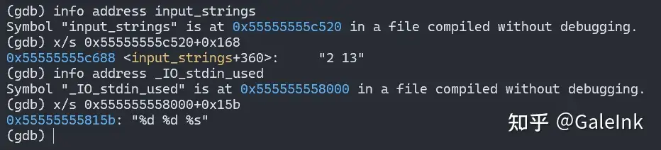
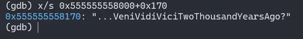
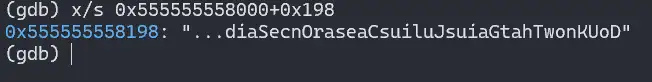
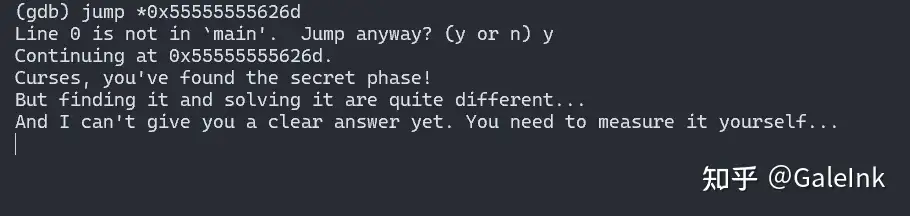
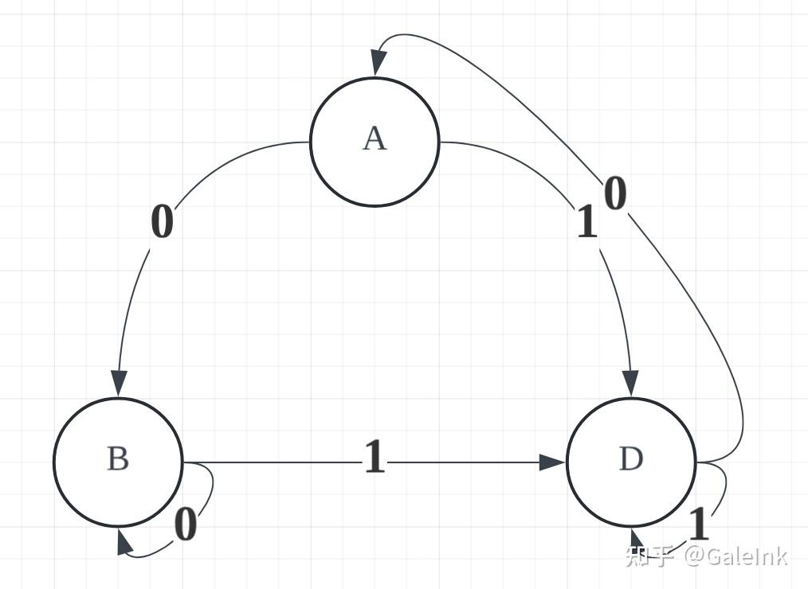
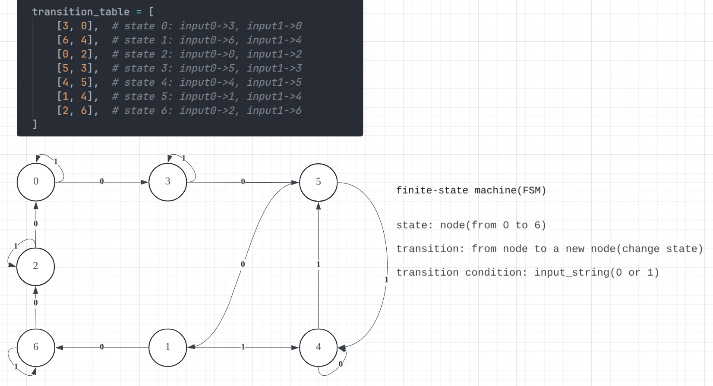

# PKU 2025 Bomblab Secret_phase解析--FSM自动机和同步检测

本人刚拿到lab因为操作不当（脑残）没设置断点直接爆了一次，大家务必不要学我，一定要在gdb运行之前给explode_bomb设置断点，或者参考https://arthals.ink/ 这位学长的博客安全化

这是在完成六个阶段之后的隐藏阶段，个人觉得很巧妙。今年的隐藏阶段不是原版的二叉树路径求和，而是FSM自动状态机，需要自行找到状态转移对应的表。本文仅给出隐藏阶段的进入方式和破解方法。

此外，进入隐藏阶段需要看懂两个魔法函数，不过为了得分可以直接强行用gbd跳到隐藏阶段的函数中，避开正面进入函数的过程。

### 进入方式

在main函数中，在完成六个阶段、执行`phase_defused`之后，就结束程序了。进一步查看`phase_defused`的汇编代码，发现里面是存在`call   1c01 <secret_phase>`的函数调用的（在2305处）。也就是说，如果想进入隐藏阶段需要在这个函数中满足某些条件。下面是`phase_defused`的汇编代码，我会对其进行逐段地分析（分析在汇编下方），其中有四处进入隐藏阶段之前的判定：（注意：以下gdb的输出均是在phase6中或完成phase6函数后的输出）

```assembly
0000000000002265 <phase_defused>:
    2265:	f3 0f 1e fa          	endbr64
    2269:	53                   	push   %rbx

    # PART 1
    226a:	48 89 fb             	mov    %rdi,%rbx
    226d:	c7 07 00 00 00 00    	movl   $0x0,(%rdi)
    2273:	48 89 fe             	mov    %rdi,%rsi
    2276:	bf 01 00 00 00       	mov    $0x1,%edi
    227b:	e8 7a fc ff ff       	call   1efa <send_msg>
    2280:	83 3b 01             	cmpl   $0x1,(%rbx)              ## 判定(1)
    2283:	75 0b                	jne    2290 <phase_defused+0x2b>

    2285:	83 3d 8c 62 00 00 06 	cmpl   $0x6,0x628c(%rip)  ## 判定(2)      # 8518 <num_input_strings>
    228c:	74 22                	je     22b0 <phase_defused+0x4b>
    228e:	5b                   	pop    %rbx
    228f:	c3                   	ret

    2290:	48 8d 35 39 21 00 00 	lea    0x2139(%rip),%rsi        # 43d0 <transition_table+0xd0>
    2297:	bf 01 00 00 00       	mov    $0x1,%edi
    229c:	b8 00 00 00 00       	mov    $0x0,%eax
    22a1:	e8 ba f0 ff ff       	call   1360 <__printf_chk@plt>
    22a6:	bf 08 00 00 00       	mov    $0x8,%edi
    22ab:	e8 e0 f0 ff ff       	call   1390 <exit@plt>

    22b0:	e8 af f3 ff ff       	call   1664 <abracadabra>
    22b5:	85 c0                	test   %eax,%eax
    22b7:	75 1a                	jne    22d3 <phase_defused+0x6e>  ## 判定(3)

    22b9:	48 8d 3d 70 22 00 00 	lea    0x2270(%rip),%rdi        # 4530 <transition_table+0x230>
    22c0:	e8 ab ef ff ff       	call   1270 <puts@plt>
    22c5:	48 8d 3d ac 22 00 00 	lea    0x22ac(%rip),%rdi        # 4578 <transition_table+0x278>
    22cc:	e8 9f ef ff ff       	call   1270 <puts@plt>
    22d1:	eb bb                	jmp    228e <phase_defused+0x29>

    22d3:	e8 19 f4 ff ff       	call   16f1 <alohomora>
    22d8:	85 c0                	test   %eax,%eax
    22da:	74 30                	je     230c <phase_defused+0xa7>  ## 判定(4)

    22dc:	48 8d 3d 5d 21 00 00 	lea    0x215d(%rip),%rdi        # 4440 <transition_table+0x140>
    22e3:	e8 88 ef ff ff       	call   1270 <puts@plt>
    22e8:	48 8d 3d 79 21 00 00 	lea    0x2179(%rip),%rdi        # 4468 <transition_table+0x168>
    22ef:	e8 7c ef ff ff       	call   1270 <puts@plt>
    22f4:	48 8d 3d a5 21 00 00 	lea    0x21a5(%rip),%rdi        # 44a0 <transition_table+0x1a0>
    22fb:	e8 70 ef ff ff       	call   1270 <puts@plt>
    2300:	b8 00 00 00 00       	mov    $0x0,%eax
    2305:	e8 f7 f8 ff ff       	call   1c01 <secret_phase>

    230a:	eb ad                	jmp    22b9 <phase_defused+0x54>
    230c:	48 8d 3d dd 21 00 00 	lea    0x21dd(%rip),%rdi        # 44f0 <transition_table+0x1f0>
    2313:	e8 58 ef ff ff       	call   1270 <puts@plt>
    2318:	48 8d 3d 81 21 00 00 	lea    0x2181(%rip),%rdi        # 44a0 <transition_table+0x1a0>
    231f:	e8 4c ef ff ff       	call   1270 <puts@plt>
    2324:	eb 93                	jmp    22b9 <phase_defused+0x54>
```

#### 判定(1)

首先第一段中：
```
    226a:	48 89 fb             	mov    %rdi,%rbx   
    226d:	c7 07 00 00 00 00    	movl   $0x0,(%rdi)
    2273:	48 89 fe             	mov    %rdi,%rsi
    2276:	bf 01 00 00 00       	mov    $0x1,%edi
    227b:	e8 7a fc ff ff       	call   1efa <send_msg>
    2280:	83 3b 01             	cmpl   $0x1,(%rbx)
    2283:	75 0b                	jne    2290 <phase_defused+0x2b>
```
将rdi的值存给rbx，这时二者保存的地址是一样的，这个地址指向的是同一个内存。接着将rdi地址所指向的内存的值设置为0x0，也就是把rbx地址所指向的内存的值设置为了0x0。之后把rdi赋值给rsi、把rdi的值设置为1，这些都不重要。然后调用send_msg函数。接着进行了第一次判定：**rbx地址所指向的内存的值 与 0x1 的判断**。

我们发现，在226d那一行，代码已经明确将(%rdi)的值设置为了0，而%rbx和%rdi所保存的地址是一样的，则(%rbx)在2280那一行判断的时候必然是0而不是1，也就是说正常的逻辑来看，这里必然会接着2283那一行的跳转，跳转到2290开始继续运行。然后将在22ab那一行完成exit函数的退出。这样将会与2305行的隐藏函数调用失之交臂。

这里的解决办法是：直接跳过2276那一行的赋值。在gdb中查看该行的地址，并在phase6完成后，跳转到main函数中并且即将进入phase_defused函数之前，在gdb中输入:

```gdb
(gdb) jump *0x55555555626d
```

即可跳过该处的判定。（这里发现只能选择跳过这一个语句，跳过其他指令好像无法正常继续运行）

#### 判定(2)

接着我们没有进入2290而是继续进行2285，这里有判定(2):**0x628c(%rip) 和 0x6 的相等关系**，如果相等就跳转到22b0，进入后续的判定中；如果不相等就直接return了。这里我们需要查看`0x628c(%rip)`处的值是多少，由于直接使用`x $rip+0x628c`是不对的，我们需要查看这里注释中给出的`num_input_strings`的地址，具体操作如下：

```gdb
(gdb) info address num_input_strings
Symbol "num_input_strings" is at 0x55555555c518 in a file compiled without debugging.

(gdb)p/d *0x55555555c518
$1 = 6
```

注意，这里是在phase6中执行的，打印结果是6；如果在之前的比如phase1中打印，值会是1。结合`num_input_strings`这个名称也可以猜出，这里是想判断目前到达了第几个阶段，如果此时到达的阶段数是6，就可以判定成功；否则不行。所以此处判定只需要完成六个阶段的题目即可。

#### 判定(3)

在上述跳转下，我们来到22b0，调用了第一个魔法函数：`abracadabra`。其返回值eax的判定中，**如果eax的值不是0**，就继续跳转到第二个魔法函数处；否则就跳回刚才return的地方。我们查看源码：

```assembly
0000000000001664 <abracadabra>:
    1664:	f3 0f 1e fa          	endbr64
    1668:	48 81 ec 98 00 00 00 	sub    $0x98,%rsp
    166f:	64 48 8b 04 25 28 00 	mov    %fs:0x28,%rax
    1676:	00 00 
    1678:	48 89 84 24 88 00 00 	mov    %rax,0x88(%rsp)
    167f:	00 
    1680:	31 c0                	xor    %eax,%eax

    1682:	48 8d 4c 24 0c       	lea    0xc(%rsp),%rcx  
    1687:	48 8d 54 24 08       	lea    0x8(%rsp),%rdx
    168c:	4c 8d 44 24 10       	lea    0x10(%rsp),%r8
    1691:	48 8d 35 c3 2a 00 00 	lea    0x2ac3(%rip),%rsi        # 415b <_IO_stdin_used+0x15b> 8000
    1698:	48 8d 3d e9 6f 00 00 	lea    0x6fe9(%rip),%rdi        # 8688 <input_strings+0x168> c520
    169f:	e8 9c fc ff ff       	call   1340 <__isoc99_sscanf@plt>
    16a4:	83 f8 03             	cmp    $0x3,%eax
    16a7:	74 20                	je     16c9 <abracadabra+0x65>

    16a9:	b8 00 00 00 00       	mov    $0x0,%eax
    16ae:	48 8b 94 24 88 00 00 	mov    0x88(%rsp),%rdx
    16b5:	00 
    16b6:	64 48 2b 14 25 28 00 	sub    %fs:0x28,%rdx
    16bd:	00 00 
    16bf:	75 2b                	jne    16ec <abracadabra+0x88>
    16c1:	48 81 c4 98 00 00 00 	add    $0x98,%rsp
    16c8:	c3                   	ret

    16c9:	48 8d 7c 24 10       	lea    0x10(%rsp),%rdi
    16ce:	48 8d 35 9b 2a 00 00 	lea    0x2a9b(%rip),%rsi        # 4170 <_IO_stdin_used+0x170>
    16d5:	e8 6d 06 00 00       	call   1d47 <strings_not_equal>
    16da:	85 c0                	test   %eax,%eax
    16dc:	74 07                	je     16e5 <abracadabra+0x81>

    16de:	b8 00 00 00 00       	mov    $0x0,%eax
    16e3:	eb c9                	jmp    16ae <abracadabra+0x4a>
    16e5:	b8 01 00 00 00       	mov    $0x1,%eax
    16ea:	eb c2                	jmp    16ae <abracadabra+0x4a>
    16ec:	e8 af fb ff ff       	call   12a0 <__stack_chk_fail@plt>
```

这个函数有两处重点：
1. 在1682-16a7之间，调用了sscanf函数获取输入，rdi是输入的字符串，rsi是获取输入的格式，将结果保存在rdx、rcx、r8这三个寄存器中；在16a4中也对输入的参数个数进行检测，如果恰好是3个才行。我们这里对rdi和rsi的字符串进行查看：



我们发现要读入的俩整数和一个字符串，而且发现这俩整数恰好就是我们在phase4中输入的俩数字。这暗示我们似乎要在phase4的那一行答案中多输入一个字符串，方便在此处读取同时也不会影响phase4的运行（因为phase4读取的是"%d %d"）。

2. 接着跳转到16c9，这里将刚刚读取的第三个参数的字符串（保存在r8中，也就是rsp+0x10的位置）地址存入rdi中，将从某位置读取的目标字符串存到rsi中，然后调用`strings_not_equal`函数得到eax，只有相等时返回值是1，才能继续运行而不中断程序。那我们继续查看rsi到底是什么东西：



好的，这样我们就得到了匹配的目标字符串是：`...VeniVidiViciTwoThousandYearsAgo?`。我们**把它加到phase4的那一行末尾中作为第三个参数**。

#### 判定(4)

我们来到22d3这第二个魔法函数：`alohomora`，同样，判定条件也是返回值不能为0。查看其汇编：

```assembly
00000000000016f1 <alohomora>:
    16f1:	f3 0f 1e fa          	endbr64
    16f5:	48 81 ec 88 00 00 00 	sub    $0x88,%rsp
    16fc:	64 48 8b 04 25 28 00 	mov    %fs:0x28,%rax
    1703:	00 00 
    1705:	48 89 44 24 78       	mov    %rax,0x78(%rsp)
    170a:	31 c0                	xor    %eax,%eax

    170c:	48 8d 05 85 6e 00 00 	lea    0x6e85(%rip),%rax        # 8598 <input_strings+0x78>
    1713:	eb 04                	jmp    1719 <alohomora+0x28>
    1715:	48 83 c0 01          	add    $0x1,%rax

    1719:	80 38 00             	cmpb   $0x0,(%rax)    
    171c:	75 f7                	jne    1715 <alohomora+0x24>
    171e:	48 83 e8 01          	sub    $0x1,%rax 

    1722:	48 89 e2             	mov    %rsp,%rdx
    1725:	eb 0a                	jmp    1731 <alohomora+0x40>

    1727:	88 0a                	mov    %cl,(%rdx)
    1729:	48 83 c2 01          	add    $0x1,%rdx
    172d:	48 83 e8 01          	sub    $0x1,%rax

    1731:	0f b6 08             	movzbl (%rax),%ecx 
    1734:	80 f9 20             	cmp    $0x20,%cl
    1737:	74 0c                	je     1745 <alohomora+0x54>
    1739:	48 8d 35 58 6e 00 00 	lea    0x6e58(%rip),%rsi        # 8598 <input_strings+0x78>
    1740:	48 39 f0             	cmp    %rsi,%rax
    1743:	75 e2                	jne    1727 <alohomora+0x36>

    1745:	c6 02 00             	movb   $0x0,(%rdx)
    1748:	48 89 e7             	mov    %rsp,%rdi
    174b:	48 8d 35 46 2a 00 00 	lea    0x2a46(%rip),%rsi        # 4198 <_IO_stdin_used+0x198>
    1752:	e8 f0 05 00 00       	call   1d47 <strings_not_equal>
    1757:	85 c0                	test   %eax,%eax
    1759:	74 1d                	je     1778 <alohomora+0x87>
    175b:	b8 00 00 00 00       	mov    $0x0,%eax
    1760:	48 8b 54 24 78       	mov    0x78(%rsp),%rdx
    1765:	64 48 2b 14 25 28 00 	sub    %fs:0x28,%rdx
    176c:	00 00 
    176e:	75 0f                	jne    177f <alohomora+0x8e>
    1770:	48 81 c4 88 00 00 00 	add    $0x88,%rsp
    1777:	c3                   	ret
    1778:	b8 01 00 00 00       	mov    $0x1,%eax
    177d:	eb e1                	jmp    1760 <alohomora+0x6f>
    177f:	e8 1c fb ff ff       	call   12a0 <__stack_chk_fail@plt>
```

首先在170c行读取了8598处的字符串到rax中。我们查看此处的字符是什么：


这里恰好是phase2的六个数字，可能和上一个函数类似，暗示我们要在这个阶段的答案中增加某些东西。这里是rax是我们phase2这一行字符串的头字符的位置。

----

* **找到字符串结尾** 170c-171e

```
170c:	48 8d 05 85 6e 00 00 	lea    0x6e85(%rip),%rax        # 8598 <input_strings+0x78>
1713:	eb 04                	jmp    1719 <alohomora+0x28>
1715:	48 83 c0 01          	add    $0x1,%rax

1719:	80 38 00             	cmpb   $0x0,(%rax)    
171c:	75 f7                	jne    1715 <alohomora+0x24>
171e:	48 83 e8 01          	sub    $0x1,%rax 
```

获得eax，跳转到1719开始第一个循环：不断比较**rax字符是否是$0x0**（0x0是字符串结尾的\0），如果不是就将rax+1，比较下一个字符；如果是，说明到达了字符串的末尾部分。那么就将eax减1，恰好到达字符串的末尾字符。

----

* **反向复制循环** 1722-1743

```
1722: mov    %rsp,%rdx          ; rdx指向栈缓冲区（目标）
1725: jmp    1731

1727: mov    %cl,(%rdx)         ; 存储字符到栈缓冲区
1729: add    $0x1,%rdx          ; 目标指针前进
172d: sub    $0x1,%rax          ; 源指针后退（关键：反向移动）

; 循环开始
1731: movzbl (%rax),%ecx        ; 读取当前字符到cl
1734: cmp    $0x20,%cl          ; 检查是否为空格字符
1737: je     1745               ; 如果是空格，结束复制

1739: lea    0x6e58(%rip),%rsi  ; rsi = 字符串起始地址(input_strings+0x78)
1740: cmp    %rsi,%rax          ; 检查是否回到字符串开头
1743: jne    1727               ; 如果没到开头，继续复制
1745: movb   $0x0,(%rdx)        ; 在复制结果后添加NULL
1748: mov    %rsp,%rdi          ; rdi = 反转后的字符串
```
首先rdx指向栈缓冲区。在跳到1731时，将rax也就是此时最后的字符复制到ecx，判断**cl与$0x20是否相等**（0x20是空格），如果相等就跳出循环，不是就继续判断**此时的rax是否回到了phase2字符串的开头字符**，如果是就把0x0(\0)存到rdx中，也就是结束了rdx中字符串的构造；如果不是就跳转到1727，把当前的字符复制到rdx中并把rax指针向前移。

----

* **字符串比较** 1745-1759

```
174b: lea    0x2a46(%rip),%rsi  ; rsi = 目标字符串地址(0x4198)
1752: call   1d47 <strings_not_equal>
1757: test   %eax,%eax          ; 检查是否相等
1759: je     1778               ; 如果相等，返回1
```

这里我们查看目标字符串是什么：



需要和这个字符串相同，也就是说，我们**输入的字符串反转后**应该和其相同，那么就应该是：`DoUKnowThatGaiusJuliusCaesarOnceSaid...`。

总之，这个函数的作用是：将phase2的第七个参数字符串反转，与目标字符串比较，相同才可以。**把上述字符串加到phase2的末尾即可**。

这样，我们在输入第一个判定的jump之后就会出现这样的语句：



我们成功进入了隐藏阶段！这里需要直接在命令行输入答案。我们继续看隐藏阶段的汇编。

### 破解方式

#### FSM前置知识

在进入这一部分之前，看到函数的名称可以发现有FSM的名称。通过查询得知，这是**finite-state machine**的缩写，即有限状态机。下面先给出一些在经过询问ai和阅读有关介绍之后的本人理解（叠甲，不保证完全正确，严谨定义和理解请参考其他资料！！）：

啥是有限状态机？搜索谷歌得知定义为：

> 有限状态机（英语：finite-state machine，缩写：FSM）又称有限状态自动机（英语：finite-state automaton，缩写：FSA），简称状态机，是表示有限个状态以及在这些状态之间的转移和动作等行为的数学计算模型。

那就可以从其组成部分来理解了。

* 状态（States）：系统可能处于的有限个状况，其特点是：在任何给定时刻，FSM只能处于一个状态，且总状态是有限的。比如一个电梯控制系统，在任意一刻只能处于静止、上行、下行、开门、关门这五个状态之一。
* 转移（Transitions）：状态之间的切换规则，其触发条件通常由输入事件触发，比如电梯在用户按关门按钮之后，机器接收到这一个信号，触发状态的转移，即从开门的状态转为关门的状态。
* 输入字母表（Input Alphabet）：所有可能输入值的集合，比如电梯系统的按钮。
* 初始状态（Initial State）：FSM开始运行时的起始状态。
* 接受状态（Accept States，可选）：表示"成功"或"完成"的状态。

举一个🌰，下面这个图是一个FSM，它有三种状态可选：A, B, C，且支持的输入字母表仅仅是0或者1，箭头表示对于一个输入，机器从一个状态转移到另一个状态。



假设其初始状态是A，我们对其输入一个0，那么就会沿着左侧从A指向B的箭头进行转移，得到一个新状态B。假设我们输入一串序列：011001，那么就会经过6次转移，按照箭头方向，过程是：

$$
A \overset{0}{\rightarrow} B \overset{1}{\rightarrow} D \overset{1}{\rightarrow} D \overset{0}{\rightarrow} A \overset{0}{\rightarrow} B \overset{1}{\rightarrow} D
$$


我们得到最终状态是D。（对于状态B和D，对于输入分别为0和1时，其状态转移到自身也就是不发生改变）

接下来，我们考虑一个有趣的问题（**同步序列问题**）：**对于机器的所有可能初始状态，能不能找到一个给定最大长度的输入序列**（假定这个FSM接收的输入都是0或者1），**使得经过这个输入序列进行状态转移之后，都得到一个相同的最终状态？如果可以，如何找到？**

拿上面那个例子说明。我们给出一个输入序列，对于所有可能的初始状态（即A、B、D），让它们经过同样的输入进行转移后，得到同样的转移后状态。不难看出，可以找到一个最短的序列：1。因为三者经过输入1转移后都到达了D，也就满足了条件。

有没有什么好的方法系统性地求解出来这个序列呢？考虑到上图中节点和边的结构，可以发现这其实是一个图，每个状态构成一个节点，输入的字符构成一条单向边。那我们可以简化上述题目如下：**对于一个有限节点的图，每个节点都有固定个数的出度**（这里设定为2，即0和1）**且可能形成自环，能否找到一个给定最大长度的输入序列**（假定输入序列由0和1构成），**使得图中以任意一个节点作为出发点经过这个输入序列的移动之后，都到达同一个节点？如果可以，如何找到？**

方便起见，我们将上述图中的初始状态编码为0，1，2，分别对应状态A，B，D。然后我们可以得到一个状态转移表：

| state | input=0 | input=1 |
|---|---|---|
| 0 | 1 | 2 |
| 1 | 1 | 2 |
| 2 | 0 | 2 |

其中第二列的数字表示，对于该数字所在行的初始状态，按照该列的输入值进行转移后，所得到的新状态。比如，对于初状态1，输入1，得到2，对应上图中B输入1得到D。

**考虑将初始状态看成一个集合**：{0，1，2}，每次输入一个字符0或1，我们对这个集合的所有元素进行同步地转移更新来得到一个新的集合。例如，输入1，通过查表得到更新后的状态集合为：{2}。我们发现，此时集合长度为1，也就是说，我们使得所有状态都到达了同一个终状态！也就是得到了答案。


> 将状态看成集合，每次输入都是对集合元素的同步操作，得到最终的结果是集合只有一种元素

有没有什么方法来找到呢？**每次输入是固定的0或者1，既然有一个给定的最大长度，那不妨直接从短到长对所有可能的序列都进行一次搜索。这不就是BFS吗**？！我们将状态集合入队列，保存一个状态转移path，每次弹出一个集合都对0或1进行转移试探，如果这个状态之前没出现过就入队，并把0或1加入到path终，否则跳过；如果path长度超过最大长度说明不能找到。我们给出下面的python代码：


```python

from collections import deque

transition_table = [
    [1, 2],  # 状态A: 输入0→B(1), 输入1→D(2)
    [1, 2],  # 状态B: 输入0→B(1), 输入1→D(2)
    [0, 2],  # 状态D: 输入0→A(0), 输入1→D(2)
]

MAX_length = 10

init_states = frozenset(range(3))

q = deque([(init_states, '')])
visited = set(init_states)
length = 0
while q:
    curr_states, path = q.popleft()
    if length > MAX_length:
        print("Impossible!")
        break
    if len(curr_states) == 1: # 三种状态都转移到了同一种状态
        print(path)
        break
    for input_num in [0, 1]:
        next_states = frozenset(transition_table[state][input_num] for state in curr_states)
        if next_states not in visited:
            q.append((next_states, path + str(input_num)))
            visited.add(next_states)
```

我们得到和上面肉眼观察相同的答案：1。这样我们就知道如何解答上述的同步序列问题了！

#### 解读隐藏阶段



下面是这个阶段的汇编代码，以及额外的两个辅助函数的汇编。在汇编中都加有注释。


```assembly
0000000000001b60 <emulate_fsm>:  -- 状态转移函数
    1b60:	f3 0f 1e fa          	endbr64
    1b64:	55                   	push   %rbp
    1b65:	53                   	push   %rbx
    1b66:	48 83 ec 08          	sub    $0x8,%rsp
    1b6a:	89 fd                	mov    %edi,%ebp  -- ebp = 初始状态
    1b6c:	48 89 f3             	mov    %rsi,%rbx  -- rbx = 输入字符串
    1b6f:	eb 28                	jmp    1b99 <emulate_fsm+0x39> -- 进入主循环1b99

    -- 状态转移计算，将遍历的初始状态(0-6)按照转移表，对应输入的0或者1得到对应的新状态
    1b71:	0f be 03             	movsbl (%rbx),%eax  -- 读取输入字符
    1b74:	83 e8 30             	sub    $0x30,%eax  -- 字符-'0'得到0或1
    1b77:	48 63 ed             	movslq %ebp,%rbp  -- rbp = 初始状态
    1b7a:	48 98                	cltq
    1b7c:	48 8d 14 c5 00 00 00 	lea    0x0(,%rax,8),%rdx  -- rdx = 输入值 * 8
    1b83:	00 
    1b84:	48 29 c2             	sub    %rax,%rdx  -- rdx = 输入值 * 7
    1b87:	48 8d 04 2a          	lea    (%rdx,%rbp,1),%rax  -- rax = 初始状态 + 输入值 * 7
    1b8b:	48 8d 15 6e 27 00 00 	lea    0x276e(%rip),%rdx        # 4300 <transition_table> 
    -- 获取转移表的地址（见下方文字叙述的转移表）
    1b92:	8b 2c 82             	mov    (%rdx,%rax,4),%ebp  -- ebp = 新状态 = table[索引]
    1b95:	48 83 c3 01          	add    $0x1,%rbx  -- rbx++，移动到下一个字符

    -- 主循环
    1b99:	0f b6 03             	movzbl (%rbx),%eax  -- 读取当前字符
    1b9c:	84 c0                	test   %al,%al  -- 检测是否为NULL
    1b9e:	74 0e                	je     1bae <emulate_fsm+0x4e>  -- 如果是NULL则无需转移，返回输入的初始状态
    1ba0:	83 e8 30             	sub    $0x30,%eax  -- 字符-'0'（得到数字）
    1ba3:	3c 01                	cmp    $0x1,%al  -- 检测是否小于等于1（是否是0或1）
    1ba5:	76 ca                	jbe    1b71 <emulate_fsm+0x11>  -- 如果是0或1就计算该数字对应的转移结果
    1ba7:	e8 b0 04 00 00       	call   205c <explode_bomb>  -- 如果不是就爆炸
    1bac:	eb c3                	jmp    1b71 <emulate_fsm+0x11>

    1bae:	89 e8                	mov    %ebp,%eax  -- 如果是NULL则无需转移，返回输入的初始状态
    1bb0:	48 83 c4 08          	add    $0x8,%rsp
    1bb4:	5b                   	pop    %rbx
    1bb5:	5d                   	pop    %rbp
    1bb6:	c3                   	ret

0000000000001bb7 <check_synchronizing_sequence>:  -- 检测序列是否完全同步（相同）函数
    1bb7:	f3 0f 1e fa          	endbr64
    1bbb:	41 54                	push   %r12
    1bbd:	55                   	push   %rbp
    1bbe:	53                   	push   %rbx
    1bbf:	48 89 fd             	mov    %rdi,%rbp  -- rbp = 输入字符串

    -- 从初始状态为0开始模拟FSM，把0的终状态作为参考与后续做比较
    1bc2:	48 89 fe             	mov    %rdi,%rsi  -- rsi = 输入字符串
    1bc5:	bf 00 00 00 00       	mov    $0x0,%edi  -- edi = 初始状态0
    1bca:	e8 91 ff ff ff       	call   1b60 <emulate_fsm>  -- 调用转移函数得到终状态
    1bcf:	41 89 c4             	mov    %eax,%r12d -- r12d = 参考最终状态

    -- 循环检查初始状态1-6
    1bd2:	bb 01 00 00 00       	mov    $0x1,%ebx  -- ebx = 初始状态(1)
    1bd7:	83 fb 06             	cmp    $0x6,%ebx  -- 开始遍历1到6
    1bda:	7f 14                	jg     1bf0 <check_synchronizing_sequence+0x39>
    1bdc:	48 89 ee             	mov    %rbp,%rsi  -- rsi = 输入字符串
    1bdf:	89 df                	mov    %ebx,%edi  -- edi = 初始状态
    1be1:	e8 7a ff ff ff       	call   1b60 <emulate_fsm> -- 得到该初始状态转移后的终状态
    1be6:	44 39 e0             	cmp    %r12d,%eax -- 比较最终状态与参考基准是否相同
    1be9:	75 0f                	jne    1bfa <check_synchronizing_sequence+0x43> -- 如果不同就跳到1bfa
    1beb:	83 c3 01             	add    $0x1,%ebx  -- 如果相同，ebx++，遍历下一个初始状态
    1bee:	eb e7                	jmp    1bd7 <check_synchronizing_sequence+0x20>

    1bf0:	b8 00 00 00 00       	mov    $0x0,%eax -- 如果1-6的初始状态都与0相同就eax设置为0返回，不会爆
    1bf5:	5b                   	pop    %rbx
    1bf6:	5d                   	pop    %rbp
    1bf7:	41 5c                	pop    %r12
    1bf9:	c3                   	ret
    1bfa:	b8 ff ff ff ff       	mov    $0xffffffff,%eax  -- 如果不同就把eax设置为全1，这样在secret函数中test eax得到1，使得爆炸
    1bff:	eb f4                	jmp    1bf5 <check_synchronizing_sequence+0x3e>

0000000000001c01 <secret_phase>:
    1c01:	f3 0f 1e fa          	endbr64
    1c05:	55                   	push   %rbp
    1c06:	53                   	push   %rbx
    1c07:	48 83 ec 18          	sub    $0x18,%rsp
    1c0b:	64 48 8b 04 25 28 00 	mov    %fs:0x28,%rax
    1c12:	00 00 
    1c14:	48 89 44 24 08       	mov    %rax,0x8(%rsp)
    1c19:	31 c0                	xor    %eax,%eax

    -- 读取输入
    1c1b:	e8 07 05 00 00       	call   2127 <read_line>
    1c20:	48 89 c5             	mov    %rax,%rbp   -- rbp = 输入字符串

    -- 检查输入长度<=17
    1c23:	bb 00 00 00 00       	mov    $0x0,%ebx   -- 计数器ebx=0
    1c28:	eb 03                	jmp    1c2d <secret_phase+0x2c>  -- 进入字符遍历
    1c2a:	83 c3 01             	add    $0x1,%ebx   -- 计数器++

    1c2d:	48 63 c3             	movslq %ebx,%rax
    1c30:	80 7c 05 00 00       	cmpb   $0x0,0x0(%rbp,%rax,1)  -- 检查字符是否为NULL
    1c35:	74 0c                	je     1c43 <secret_phase+0x42>  -- 如果是NULL跳出遍历结束检查
    1c37:	83 fb 10             	cmp    $0x10,%ebx  -- 比较长度是否<=17
    1c3a:	7e ee                	jle    1c2a <secret_phase+0x29>  -- 如果是就继续检查下一个字符是不是NULL
    1c3c:	e8 1b 04 00 00       	call   205c <explode_bomb>  -- 如果不是就爆炸
    1c41:	eb e7                	jmp    1c2a <secret_phase+0x29>

    -- 检查同步序列 check_synchronizing_sequence
    1c43:	48 89 ef             	mov    %rbp,%rdi  -- rdi = 输入字符串
    1c46:	e8 6c ff ff ff       	call   1bb7 <check_synchronizing_sequence>
    1c4b:	85 c0                	test   %eax,%eax
    1c4d:	75 45                	jne    1c94 <secret_phase+0x93>  -- 如果检查同步失败就爆炸，下面的输出成功信息并返回
    1c4f:	48 8d 3d aa 25 00 00 	lea    0x25aa(%rip),%rdi        # 4200 <_IO_stdin_used+0x200>
    1c56:	e8 15 f6 ff ff       	call   1270 <puts@plt>
    1c5b:	48 8d 3d ce 25 00 00 	lea    0x25ce(%rip),%rdi        # 4230 <_IO_stdin_used+0x230>
    1c62:	e8 09 f6 ff ff       	call   1270 <puts@plt>
    1c67:	48 8d 3d 1a 26 00 00 	lea    0x261a(%rip),%rdi        # 4288 <_IO_stdin_used+0x288>
    1c6e:	e8 fd f5 ff ff       	call   1270 <puts@plt>
    1c73:	48 8d 7c 24 04       	lea    0x4(%rsp),%rdi
    1c78:	e8 e8 05 00 00       	call   2265 <phase_defused>
    1c7d:	48 8b 44 24 08       	mov    0x8(%rsp),%rax
    1c82:	64 48 2b 04 25 28 00 	sub    %fs:0x28,%rax
    1c89:	00 00 
    1c8b:	75 0e                	jne    1c9b <secret_phase+0x9a>
    1c8d:	48 83 c4 18          	add    $0x18,%rsp
    1c91:	5b                   	pop    %rbx
    1c92:	5d                   	pop    %rbp
    1c93:	c3                   	ret
    1c94:	e8 c3 03 00 00       	call   205c <explode_bomb>
    1c99:	eb b4                	jmp    1c4f <secret_phase+0x4e>
    1c9b:	e8 00 f6 ff ff       	call   12a0 <__stack_chk_fail@plt>
```

----

汇编代码的详细解释在上述双短横线的注释中，下面用deepseek给出一个c语言版本方便理解：

```c
// Generated by Deepseek

int emulate_fsm(int initial_state, const char* input) {
    int current_state = initial_state;
    const char* ptr = input;
    
    while (*ptr != '\0') {
        // 验证输入只能是'0'或'1'
        int input_val = *ptr - '0';
        if (input_val != 0 && input_val != 1) {
            explode_bomb();
        }
        
        // 计算状态转移索引: index = current_state + input_val * 7
        int index = current_state + input_val * 7;
        
        // 从转移表中获取新状态
        current_state = transition_table[index];
        
        ptr++;  // 下一个字符
    }
    
    return current_state;
}

int check_synchronizing_sequence(const char* input) {
    // 从位置0开始模拟，得到参考最终状态
    int reference_state = emulate_fsm(0, input);
    
    // 检查从位置1-6开始模拟是否都到达相同状态
    for (int start_pos = 1; start_pos <= 6; start_pos++) {
        int final_state = emulate_fsm(start_pos, input + start_pos);
        if (final_state != reference_state) {
            return -1;  // 失败
        }
    }
    
    return 0;  // 成功
}

void secret_phase() {
    char* input = read_line();
    
    // 检查输入长度 ≤ 16
    int length = 0;
    for (int i = 0; ; i++) {
        if (input[i] == '\0') {
            break;
        }
        if (i > 16) {
            explode_bomb();  // 长度超过16，爆炸
        }
    }
    
    // 检查是否为同步序列
    int result = check_synchronizing_sequence(input);
    if (result != 0) {
        explode_bomb();  // 不是同步序列，爆炸
    }
    
    // 成功输出
    // puts("恭喜！你找到了同步序列！");
    // puts("这个序列无论从哪个位置开始，都能让FSM到达相同状态。");
    // puts("隐藏阶段通过！");
    
    phase_defused();
}

```

* 首先，这是一个**FSM状态自动机**；
* 其次，状态转移表需要在gdb中自行找到，并且按照正确的顺序填表；
* 最后，题目要求对于从0到6的七种初始状态，应输入一个01字符串，使得经过这个字符串序列进行状态转换后，得到的七种新状态是一致的。

---

从gdb查看状态转移表的具体内容：

```
(gdb) info address transition_table 
Symbol "transition_table" is at 0x555555558300 in a file compiled without debugging. 

(gdb) x/64xb 0x555555558300 

0x555555558300 <transition_table>: 0x03 0x00 0x00 0x00 0x06 0x00 0x00 0x00 
0x555555558308 <transition_table+8>: 0x00 0x00 0x00 0x00 0x05 0x00 0x00 0x00 
0x555555558310 <transition_table+16>: 0x04 0x00 0x00 0x00 0x01 0x00 0x00 0x00 
0x555555558318 <transition_table+24>: 0x02 0x00 0x00 0x00 0x00 0x00 0x00 0x00 
0x555555558320 <transition_table+32>: 0x04 0x00 0x00 0x00 0x02 0x00 0x00 0x00 
0x555555558328 <transition_table+40>: 0x03 0x00 0x00 0x00 0x05 0x00 0x00 0x00 
0x555555558330 <transition_table+48>: 0x04 0x00 0x00 0x00 0x06 0x00 0x00 0x00
```

对应的状态表：

|state|input 0|input 1|
|---|---|---|
|0|3|0|
|1|6|4|
|2|0|2|
|3|5|3|
|4|4|5|
|5|1|4|
|6|2|6|

给出一个图示：


这里表是 **按照列填充** 的，为什么呢？原因在`emulate_fsm`中有这样一段状态转移的逻辑：

```
; 状态转移计算
1b71: movsbl (%rbx),%eax        ; 读取字符
1b74: sub    $0x30,%eax         ; eax = 输入值(0或1)
1b77: movslq %ebp,%rbp          ; 扩展当前状态
1b7a: cltq                      ; 扩展输入值
1b7c: lea    0x0(,%rax,8),%rdx  ; rdx = 输入值 * 8
1b84: sub    %rax,%rdx          ; rdx = 输入值 * 7
1b87: lea    (%rdx,%rbp,1),%rax ; rax = 当前状态 + 输入值*7
1b8b: lea    0x276e(%rip),%rdx  ; rdx = transition_table地址
1b92: mov    (%rdx,%rax,4),%ebp ; 新状态 = table[索引]
1b95: add    $0x1,%rbx          ; 移动到下一个字符
1b99: jmp    主循环开始
```

也就是说，下一个状态的值是这样计算的：

$$ state_{new} = table[4_{bytes} \cdot (state_{old} + 7 \cdot input_{{0,1}})] $$

比如，当前状态是0，输入0得到的新状态仍然是0；输入1，得到的状态应该是table[4*7]，跨越7个4字节，也就是跨越了一列，到达第二列0对应的输入为1的新状态0。

---

那么我们怎么找到一个长度不超过17的01序列，使得对于0-6这七种初始状态，都能得到一个相同的终状态呢？这是一个算法题，考虑用**BFS**来解决，相当于对每次的0和1输入进行遍历，一旦发现七种状态都相同了就返回路径。下面是python代码：

```python
from collections import deque

transition_table = [
    [3, 0],  # state 0: input0->3, input1->0
    [6, 4],  # state 1: input0->6, input1->4
    [0, 2],  # state 2: input0->0, input1->2
    [5, 3],  # state 3: input0->5, input1->3
    [4, 5],  # state 4: input0->4, input1->5
    [1, 4],  # state 5: input0->1, input1->4
    [2, 6],  # state 6: input0->2, input1->6
]

init_states = frozenset(range(7))

q = deque([(init_states, '')])
visited = set(init_states)
length = 0
while q:
    curr_states, path = q.popleft()
    if length > 17:
        print("Impossible!")
        break
    if len(curr_states) == 1: # 七种状态都转移到了同一种状态
        print(path)
        break
    for input_num in [0, 1]:
        next_states = frozenset(transition_table[state][input_num] for state in curr_states)
        if next_states not in visited:
            q.append((next_states, path + str(input_num)))
            visited.add(next_states)
```

这段代码中使用了frozenset，原因是我们想把这7个值的状态保存到visited这个set中，set中存set是不行的，但是存frozenset是可以的。运行结果是10101010100000101。这就是隐藏阶段的答案了！大功告成！

（后记：将答案写到answer.txt的第七行，并把其作为参数传递给bomb，可以不用执行检测一中的jump，就能够完成隐藏阶段）