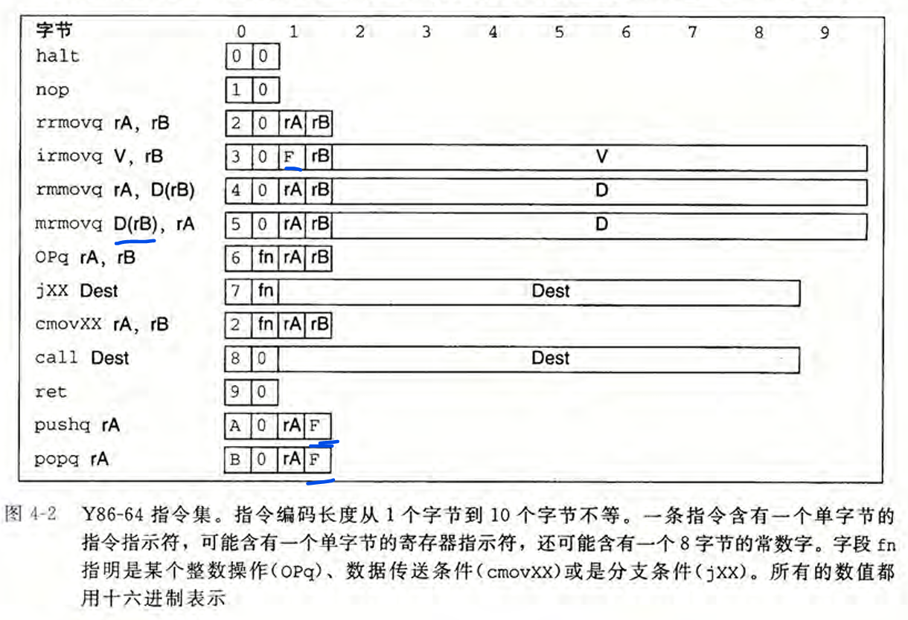
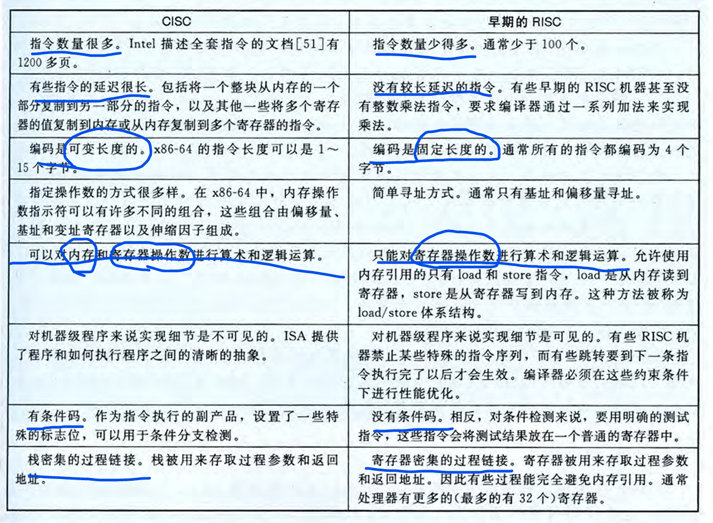
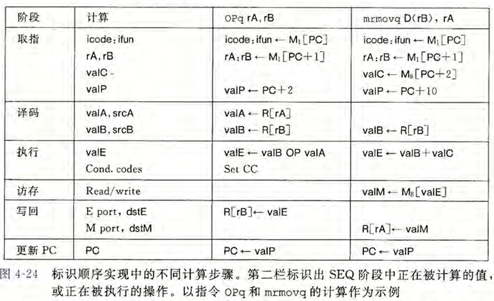
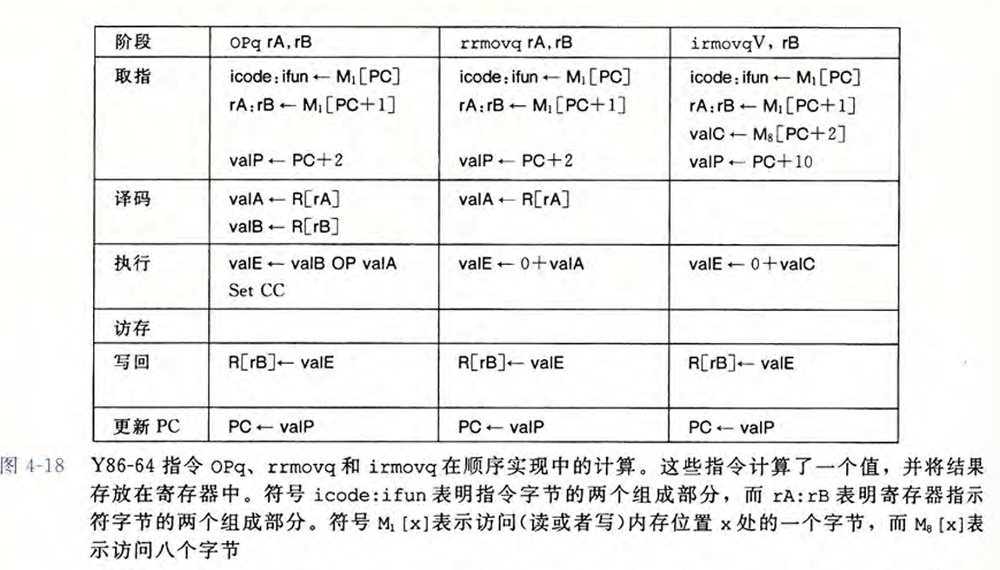
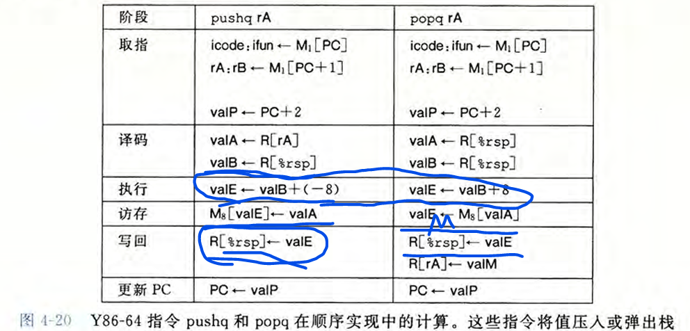
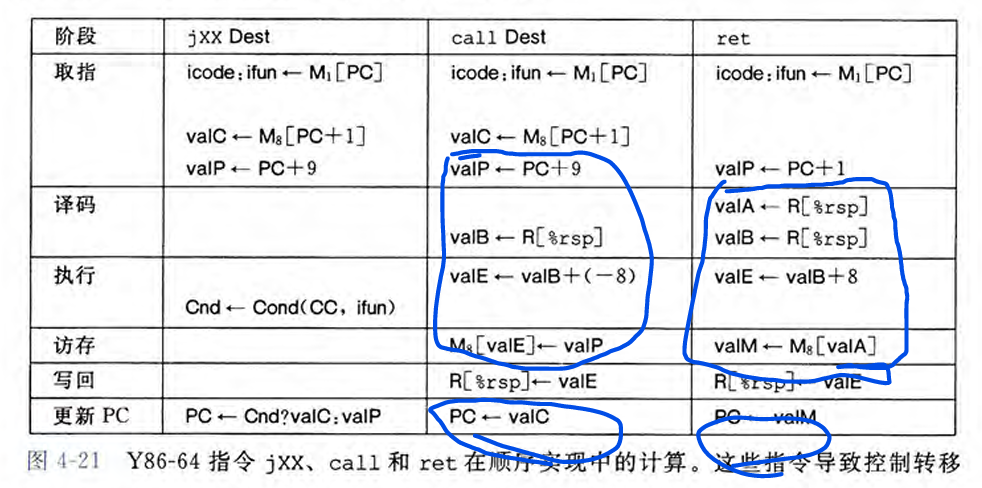

<!-- generated_toc begin -->
- [0. 读前准备](#0-读前准备)
- [1. 计算机系统漫游](#1-计算机系统漫游)
- [2. 信息的表示和处理](#2-信息的表示和处理)
  - [2.1 信息存储](#21-信息存储)
  - [2.2 整数表示](#22-整数表示)
  - [2.3 整数运算](#23-整数运算)
    - [2.3.1 无符号加法](#231-无符号加法)
    - [2.3.2 补码加法](#232-补码加法)
    - [2.3.3 补码加法](#233-补码加法)
    - [2.3.4&5&6&7 乘法和除法](#234567-乘法和除法)
  - [2.4 浮点数](#24-浮点数)
- [3. 程序的机器级表示](#3-程序的机器级表示)
  - [3.2 程序编码](#32-程序编码)
  - [结构体对齐](#结构体对齐)
  - [指针运算](#指针运算)
  - [浮点数](#浮点数)
<-- generated_toc end -->

# CSAPP

阅读CSAPP的笔记。

各个lab在其他的文件夹中。


## 0. 读前准备

其实在此之前（读前之前）已经接触到了Linux相关的命令行操作了（如使用GitBash来从本地将更新的代码`push`到远端；或者用picgo把本地图片上传到远端，再用`pull`指令拉到本地文件夹）。
之后看到网上说vim是编辑器之神（这里网上包括知乎、csdn、南大的ICS课程的课前准备），便去详细了解了一下vim的使用，并对其进行了外观的配置，变得更加好看了。
说一下我对vim的感受：无gui的按钮操作，全部都是键盘按键完成（当然这是在关闭鼠标操作设置的前提下，不过我发现即使开启了鼠标的操作功能，在root下开启vim会使用最最最原始的配置），
而且这个编辑器既然是存在于Linux系统中的，于是可以编写各种代码如python、cpp，并随时保存和在命令行中（编译和）运行，实际上与windows系统中的pycharm或者vscode功能是差不多的。

但是配置完成后真的很酷啊！效果图如下（第二张是设置了JetBrains Mono字体的）：


这里附上我配置vim参考的链接教程：`https://blog.csdn.net/qq_42417071/article/details/139027077` 。

对vim的配置主要是对vimrc的内容进行修改，第一步是先对其复制得到一个拷贝，粘贴到~下，重命名为.vimrc，每次访问的命令就是：`ink@gale:~$ vim .vimrc`。我把配置文件内容都放在了这个repo的vimrc文件夹[我的 Vim 配置](vimrc/myconfig.vim)中，可以用来参考。
（尽量实现了类似于vscode编辑代码时的自动功能，但仍有一些不完善的地方，..也懒得改了主要是我自己不太会写shell脚本，需要靠互联网和gpt和deepseek三者辅助修改，比较麻烦吧）

此外，在vim中下载了tmux的包，这样可以在一个窗口中建立多个pane，如在左侧写py代码，在右侧随时执行这个文件，实现和pycharm类似的功能（我的配置中设置了`\1`作为热键在完成操作：
保存当前代码文件`:w`->向右侧pane中发送指令`python3 %`->将光标移到右侧pane中（这样方便输入测试数据））

其实最后用的还是vscode的ssh（（有点难绷

## 1. 计算机系统漫游

## 2. 信息的表示和处理

### 2.1 信息存储

* 8位=1字节

内存由一大块字节数组组成，每个字节都由一个唯一的数字来标识，这个数字就是它的地址。所有可能地址的集合就是**虚拟地址空间**。*相当于把整个内存看出一个字典，键是唯一标识数字--地址，值是这个地址对应的内存位置的这个字节所存的内容*

✔️**二进制、十进制、十六进制的转换**：
1. bin<->hex
二进制转十六：从后往前分割4位，逐个转换；

十六转二进制：逐位转换

当x=2^n时，二进制为1后面跟n个0，当n=i+4j时，对应十六进制：0x(2^i)(0*j)
2048=2^11, 11=3+4*2, 0x800
2. dec<->hex
十进制转十六：不断做除法取余数，最后用stack反转结果

十六转十进制：从地位到高位乘16的对应次方

✔️**寻址和字节顺序**：
每个字节都有一个编号数字来标识，叫做其地址。那么一个字节是8位，对应到十六进制中就是两个数字（或者a到f中的字母）。

对于一个int类型的变量x（假设是32位的），假设十六进制值位0x01234567，那么它的内存地址是需要4个字节的，每个字节保存俩个数字。
同时对于跨越多个字节的对象，这个对象的地址是**所使用的所有字节中最小的地址**。假设x变量的地址为0x100（说明四个字节地址最小的为0x100）

在保存时采用一块连续的内存地址，有两种方式：`最低有效字节在前面（**小端法**）`和`最高有效字节在前面（**大端法**）`，
则对于连续字节地址：0x100,0x101,0x102,0x103，采用大端法为：01,23,45,67，小端法为:67,45,23,01。

> *EX*: `hello, world!`在大段和小端中存储方式是一样的。

但是在表示字符串的时候，无论是大端法的机器还是小端法的机器，输出的结果都是按照字符串的前后顺序，因为字符串的末尾是null。

对于代码的编译，不同系统上的指令编码是不同的，因此二进制代码很少能在不同机器之间移植。

✔️**位级运算**：

布尔运算：

与& 或| 异或^ 取反~ 位移>> <<

逻辑运算：

and &&; or ||; not !
返回值都是0或者1

p && *p 防止解引用空指针

一个常见用法是实现**掩码运算**，例如位级运算`x&0xFF`生成一个由x的最低有效字节组成的值，比如： 
`0x2342A4EF & 0xFF = 0xEF`。而掩码`~0`将生成一个全为1的掩码。

利用是：要取出x的最高三字节：`x&0xFFFFFF00`
要取出x的最低一字节：`x&0xFF`

bitset(x,y):把y是1的位置在x中设为1 --> `(x | y)`
bitclean(x,y):把y是1的位置在x中设为0 --> `(x & ~y)`

实现异或：`x ^ y == bis(bic(x,y), bic(y,x)) --> x ^ y == (x & ~y) | (~x & y)`

注意位级运算与逻辑运算的差别，&&如果左侧为假直接返回0而不判断右侧，||如果左侧为真直接返回1而不判断右侧，`x==y <-> !(x^y)`

✔️**位移运算**：
|操作|值|
|:--:|:--:|
|x|`[01100011] [10010101]`|
|x << 4|`[00110000] [01010000]`| 
|x >> 4(逻辑右移)|`[00000110] [00001001]`|
|x << 4(算术右移)|`[00000110] [11111001]`|


> 逻辑位移不逻辑，不保留符号位只无脑右移

注：在Java中，x>>>4才是逻辑右移。算术右移会根据正负补齐高位，逻辑右移只会补0.

优先级：移位运算优先级比加减法要低。


### 2.2 整数表示

✔️**整形数据类型**：
C数据类型在32位和64位的整数取值范围只有long和unsigned long有区别：32为`2**32-1`；64为`2**64-1`.

在x86-64中：

char : 1 byte

short: 2 bytes

int  : 4 bytes

float: 4 bytes

long : 8 bytes

pointer: 8 bytes

✔️**无符号数的编码(正整数)**：
对于一个有$w$位的整数数据类型，可以把位向量写成$\overrightarrow{x}$，且每一位的取值为0或1。那么可以给出无符号数的编码定义：

对向量$\overrightarrow{x}=[x_{w-1},x_{w-2},\cdots,x_0]$:

$$B2U_w(\overrightarrow{x}) \doteq \sum_{i=0}^{w-1} x_i2^i$$

其中$B2U_w$为Binary to Unsigned的缩写，长度为w。

与此同时，无符号数编码具有唯一性，即函数$B2U_w$是一个双射。

那么当向量表示为$[11...1]$时最大值为$2^w-1$，表示为$[00...0]$时最小值为$0$.

✔️**补码的编码(负整数)**：
对于负数值的表示，常常使用补码（two's-complement）形式表示，将字的最高有效位解释为负权（negative weight）。给出补码定义：

对向量$\overrightarrow{x}=[x_{w-1},x_{w-2},\cdots,x_0]$:

$$B2T_w(\overrightarrow{x}) \doteq -x_{w-1}2^{w-1}+\sum_{i=0}^{w-2} x_i2^i$$

其中$B2T_w$为Binary to Two's-complement的缩写，长度为w。

$B2T_w([0101])=5$

$B2T_w([1011])=-5$

与此同时，补码编码具有唯一性，即函数$B2T_w$是一个双射。

那么当向量表示为$[011...1]$时最大值为$2^{w-1}-1$，表示为$[100...0]$时最小值为$-2^{w-1}$.

对于字长w=8，给出表示整数的最值：

$UMax_w = 2^w-1=255=0xFF$

$TMax_w = 2^{w-1}-1=127=0x7F$

$TMin_w = -2^{w-1}=-128=0x80$

$-1=[11111111]=0xFF$

$0=[00000000]=0x00$

**TIPS**：
1. $(1):|TMin|=|TMax|+1$，$(2):UMax=2TMax+1$.且在有符号表示中，-1为全为1的串。
2. 对于32位的机器，由8个十六进制数字组成的，且开始的那个数字（最高的第8位）是8-f之间的任何值，都是一个负数。但是0x8048337是一个整数（补高位0）。

补充：
还有两种标准的表示方式和：
**反码（Ones' Complement）** $$B2O_w(\overrightarrow{x}) \doteq -x_{w-1}(2^{w-1}-1)+\sum_{i=0}^{w-2}x_i2^i$$

**原码（Sign-Magnitude）** $$B2S_w(\overrightarrow{x}) \doteq (-1)^{x_{w-1}} \cdot (\sum_{i=0}^{w-2}x_i2^i)$$

✔️**有符号数和无符号数之间的转换**：

基本原则：**数字的位表示不变，仅仅改变理解这个位表示的方式**。

> **强制类型转换的结果保持位值不变，只是改变了解释这些位的方式。**

此外，在有符号和无符号进行比较时，会**将有符号数隐式转换为无符号数**，例如`-1 > 0u`是正确的。因为-1会被转为UMAX-1。

1. 补码转为无符号数：

$$
T2U_w=
\begin{cases}
x,\ x\geq0\\
x+2^w,\ x<0\\
\end{cases}
$$

其中满足$TMin_w \leq x \leq TMax_w$

2. 无符号数转为补码：

$$
U2T_w=
\begin{cases}
x,\ x \leq TMax_w\\
x-2^w,\ x > TMax_w\\
\end{cases}
$$

其中满足$0 \leq x \leq UMax_w$

3. C语言中有符号数与无符号数的表示

遵循一个最基本的原则：给定一个数字，其二进制的底层表示是固定不变的，而最终这个数字表示的含义要根据自己赋予其的数据类型去解释。
比如对于2^31（2147483648），其十六进制表示为0x80000000，如果是int类型（4字节，有符号数），那么最高位（第32位）为1，说明这是一个负数（最高位是8-f的都是负数），
根据$T2U_w$的公式得知其表示的数字实际上为-2147483648；如果是unsigned类型（4字节，无符号数，可以写成2147483648u/U），那么最高位解释为正权值，
因此表示为正的2147483648。然而，尽管在两种表示方式下数值是不同的，其二进制表示形式是一致的，只是对二进制的解释方式的差别导致的数值的大小差别。

在对数值进行比较时，如果两个数分别为有符号和无符号，那么会将有符号隐式地转为无符号进行比较，即有如下布尔值：

2147483647 > -2147483647-1 --> 均为有符号 --> true

2147483647u > -2147483647-1 --> 将右侧的有符号转为无符号（+2147483648） --> false

✔️**扩展一个数字的位表示**：

1. 无符号数的零扩展

直接在最高位补0即可。

2. 有符号数的符号扩展

保持与当前最高位一致，向前补齐，是1补1，是0补0.

**TIP：** 对于有符号数，可以把高位的1都删去，直到这一连续的1串只剩下1个1的时候，数值是相等的，比如：
-5=[1011]=[11011]=[111011]

✔️**截断数字**：

从汇编代码的视角去看：

小到大：先扩展，按照原来的符号位进行符号位扩展，然后存大的字节

大到小：直接存对应大长度的寄存器，然后读取低位到目标内存

1. 截断无符号数

$令\overrightarrow{x}是一个w位的向量，而\overrightarrow{x'}是将其截断为k位的结果。令x=B2U_w(\overrightarrow{x}),
x'=B2U_k(\overrightarrow{x'})。则有x'=x \mod 2^k。$

2. 截断有符号数

$令\overrightarrow{x}是一个w位的向量，而\overrightarrow{x'}是将其截断为k位的结果。令x=B2U_w(\overrightarrow{x}),
x'=B2T_k(\overrightarrow{x'})。则有x'=U2T_k(x\mod2^k)。$

### 2.3 整数运算

#### 2.3.1 无符号加法

原理1：

无符号数加法：

对满足 $0 \leq x,y < 2^w$ 的 $x$ 和 $y$ 有：

$$
x +_w^{u} y=
\begin{cases}
x+y,\ x+y<2^w\ (正常)\\
x+y-2^w,\ 2^w \leq x+y < 2^{w+1}\ (溢出)\\
\end{cases}
$$

> 检测**无符号整数加法是否发生了溢出**：
> 
> 如果和s< x(or s < y)，则发生了溢出。

原理2：

无符号数求反：

对满足 $0 \leq x,y < 2^w$ 的 $x$ ，其w位的无符号逆元$-_w^{u}x$由下式给出：

$$
-_w^{u}x =
\begin{cases}
x,\ x=0\\
2^{w}-x,\ x>0\\
\end{cases}
$$

对十六进制数字先变为dec，然后计算逆元，再变为16进制

#### 2.3.2 补码加法

原理：

补码加法：

对满足 $-2^{w-1} \leq x,y \leq 2^{w-1}-1$ 的 $x$ 和 $y$ 有：

$$
x +_w^{t} y=
\begin{cases}
x+y-2^w,\ 2^{w-1} \leq x+y \ (正溢出)\\
x+y,\ -2^{w-1} \leq x+y < 2^{w-1} \ (正常)\\
x+y+2^w,\ x+y < -2^{w-1}\ (负溢出)\\
\end{cases}
$$

(考虑负溢出为什么必定是加 $2^w$ :因为从w+1位截断到w时，首位的1后面的第二位必定是0，否则这个数字就大于w位的最小负值了，见上面的TIP)

> 检测**补码加法和减法是否溢出**:
>
> 对于减法，如果x和y的符号位不同，且x-y的符号位也与x不同，说明发生了溢出。
> 也就是 (sx ^ sy)&(sx ^ (sd)) == 1, 其中sd = (x - y) >> 31
>
> 对于加法，如果x和y的符号位相同，且x+y的符号位与x不同，说明发生了溢出。
> 也就是 (~(sx ^ sy))&(sx ^ (sd)) == 1

#### 2.3.3 补码加法

一个易错点是，TMIN是0x80000000，当取相反数时，-TMIN = ~TMIN + 1 = TMIN，即**TMIN的相反数是其本身**。

#### 2.3.4&5&6&7 乘法和除法

相当于先乘法，然后截断到低位。

有符号只是在最后多加一步，将位级解释为有符号即可。

如果乘数的2的幂次，那就相当于左移幂次。

考虑乘数为K，其位表示中存在从位置n到位置m的连续的1，有两种形式计算：

1. $(x << n) + (x << (n-1)) + ... + (x << m)$
2. $(x << (n + 1)) - (x << m)$

对于除以2的幂次，
1. 定义整数除法是向零舍入。
2. **除以2的幂的无符号除法**：直接右移k位，会向0取整。（也就是向下取整）
3. **除以2的幂的补码除法**：直接右移k位，会向下取整。
4. 综合2和3，可以发现，对于有符号和无符号，**如果直接使用右移操作符，得到的效果都是向下舍入的**。即$x>>k = \lfloor x / 2^k \rfloor$
5. 如果想要让负数**向上舍入**，可以加上一个*偏置 biasing*值，由于除数的2^k，那么偏置值就是2 ^ k-1，也就是：$(x+(1<<k)-1)>>k = \lceil x / 2 ^k \rceil$。
6. 综合3和5，可以发现，在C语言中可以用一行代码实现真正的除以2^k的操作，也就是，我们想要实现的是不管这个数字是正还是负，我们都想要**向0舍入**，那么就可以写为：`(x < 0 ? x+(1 << k)-1 : x) >> k`，这样可以完美计算x/2^k。

总结：整数除法定义为向0舍入，但是直接右移会导致向下舍入，因此对于负数要加上一个偏置来保证向0舍入。

### 2.4 浮点数

**IEEE浮点表示**

目的是给定x和y，来表示形如$x \times 2^y$的数。

$V = (-1)^s \times M \times 2^E$

其中，
* s(sign)是**符号位**，决定是负数还是正数
* E(exponent)是**阶码**，对浮点数加权。解释为无符号数，通过偏置解释为有符号数。
* M(significand)是**尾数**，是一个二进制小数，在规格化值中范围是$1 \sim 2-\epsilon$，在非规格值中范围是$0 \sim 1-\epsilon$，原因是在规格化中有一个隐含的前置0。

|类型|位数|s|exp|frac|
|:--:|:--:|:--:|:--:|:--:|
|float|32|1|8|23|
|double|64|1|11|52|

1. 规格化的值
   1. 当exp不全为0也不全为1时，阶码的值$E = e - Bias$，其中偏置$Bias = 2^{k-1}-1$（单精度是127，双精度是1023），因此整体的范围，对于单精度是-126~127，双精度是-1022~1023。
   2. 此时的小数字段frac是f，尾数$M = 1 + f$，有一个隐含的1。
2. 非规格化的值
   1. 当阶码都是0时，阶码$E = 1 - Bias$，尾数$M = f$，无隐含的1。
3. 特殊值
   当阶码都是1时，小数为0时得到的值是正负无穷；小数非0时成为NaN。
   
如下图可以直观看出几类数字的范围。


一个属性：对于正数，将位表示看为无符号数，大小与小数的原本大小是一致的；而负数则是相反的。则可以用过以下代码实现对浮点数的比较：

```cpp
unsigned int float_to_uint(float f) {
  unsigned int u = (unsigned int) f;
  // 如果是负数，翻转所有位
  if (u >> 31) {
    return ~u;
  } else {
    return u | 0x80000000; // 正数：最高位置为1
  }
}
```

**整数转为浮点数**：

例如对于12345，0b11000000111001，
* 先将小数点左移13位，得到1.(...) * 2^13，括号内有13位，
* 将括号内后面补10个0，构成23位的小数部分，
* 阶码无符号的值为13+127=140，即0b10001100，
* 再填上符号位的0，得到最终float的二进制表示。

```c
/* 
 * float_i2f - Return bit-level equivalent of expression (float) x
 *   Result is returned as unsigned int, but
 *   it is to be interpreted as the bit-level representation of a
 *   single-precision floating point values.
 *   Legal ops: Any integer/unsigned operations incl. ||, &&. also if, while
 *   Max ops: 30
 *   Rating: 4
 */
unsigned float_i2f(int x) {
  int sign = (1 << 31) & x, first1, idx, exp, frac, mask = 0x7fffff, out,
  if (x == 0) return 0;
  if (x == (1<<31)) return 0xcf000000;

  if (sign) x = -x;
  for (idx = 31; idx >= 0; idx--) {
    if (x >> idx) {
      first1 = idx;
      break;
    }
  }

  exp = first1 + 127;

  x <<= (31 - first1);
  frac = (x >> 8) & mask;
  out = x & 0xff;
  if (out > 0x80 || (out == 0x80 && (frac & 1))) {
    frac = frac + 1;
  }
  if (frac >> 23) {
    frac = frac & mask;
    exp++;
  }
  return sign | (exp << 23) | frac;
}
```


**舍入**：

IEEE浮点格式定义了四种不同的舍入方式，分别是：
* $向偶数舍入$，是**默认**的方式。舍入的结果是使得*最低有效数字是偶数*。
  * 比如1.4舍入为1，而1.5和2.5舍入为2。
  * 对于二进制数字，仍然考虑舍入之后的最低位的偶数性。对于形如$XXX.YYYY100$的数字，当最后一个Y为将要舍入的位时，这种舍入方式才生效。当这个Y是0时，采用向下，把1抹去；当这个Y是1时，采用向上，使得Y变为0进位。
* $向零舍入，向下舍入，向上舍入$

**浮点运算**：

* 由于舍入的问题，实数运算具有交换律，但**不具备结合律**。例如，`(3.14 + 1e10) - 1e10 = 0.0`，因为舍入3.14被丢掉。
* 浮点加法满足单调性，如果 $a \ge b,  \forall x, x + a \ge x + b $。
* 可以保证，只要 $ a \ne NaN $，就有 $ a *^f a \ge 0 $。


**强制类型转换中的舍入**：

* int -> float: 数字不会溢出，但是有可能被*向偶数舍入*。
* int/float -> double: 能保留精准的数值。
* double -> float: 可能会溢出；也可能被*向偶数舍入*。
* float/double -> int: 值会*向零舍入*。

## 3. 程序的机器级表示

### 3.2 程序编码

**机器级代码**：

程序计数器（PC，%rip）给出**将要执行的下一条指令**在内存中的地址。  

使用`linux> gcc -Og -S mycode.c`来获得汇编文件`mycode.s`。

> 这一章的内容阅读教材即可，都是指令的记忆和熟悉，我在第一次月考之前通过拟合往年题也对于一些知识点有了更深的了解，比如结构体对齐、指针运算等等，这里稍微留下一些记录吧。此外，这一章关于汇编代码的考察集中在02-bomblab中，对于栈的理解和对程序的攻击的考察集中在03-attacklab中，通过做lab也可以对本章内容有更深入的理解和掌握。

### 结构体对齐

对于struct和union，对齐要求是：

1.  **结构体/联合体的首地址**：必须是其内部**最大基本数据类型成员大小**的整数倍。
2.  **结构体每个成员相对于结构体首地址的偏移量**：必须是该成员自身大小的整数倍。如果不能满足，需要在成员之间填充（padding）空白字节。 (注意，这里说的是**每个成员的地址**，下面有示例说明)
3.  **结构体总大小**: 必须是**最大对齐数**（结构体内部**最大基本数据类型成员大小**）的整数倍。如果不能满足，需要在最后一个成员后填充空白字节。(如果struct里面存放了union，按照union中的最大对齐数来计算而不是整个union的大小)
4.  **联合体的大小**：是其内部**所有成员中占用空间最大的成员**的大小。

示例：

```c
struct A {
  char a;     // 1 byte
  int b;      // 4 bytes
  short c;    // 2 bytes
};

struct B {
  char a;     // 1 byte
  short b;    // 2 bytes
  int c;      // 4 bytes
};
```

对于结构体A：

1.  `a` 占用1个字节，偏移量为0。
2.  `b` 占用4个字节，**需要对齐到4的倍数**，因此 `a` 后面填充3个字节。`b` 的偏移量为4。（这里对应了上面规则的第二条，不能直接把int放在char后面，因为char后面的地址是1，不是4的倍数，所以要补三个字节的padding，此时地址是4，可以放int了）
3.  `c` 占用2个字节，需要对齐到2的倍数，`c` 的偏移量为8。
4.  结构体总大小需要是 4 的倍数。当前大小是 10，需要填充2个字节，所以总大小为12。

对于结构体B：

1.  `a` 占用1个字节，偏移量为0。
2.  `b` 占用2个字节，需要对齐到2的倍数，因此 `a` 后面填充1个字节。`b` 的偏移量为2。
3.  `c` 占用4个字节，需要对齐到4的倍数，`c` 的偏移量为4。
4.  结构体总大小需要是4的倍数。当前大小是7，需要填充1个字节，所以总大小为8。


```c
union MyUnion {
  int a;       // 4 bytes
  double b;    // 8 bytes
  char c[10];  // 10 bytes
};
```

`MyUnion` 的大小将是 16 字节，因为 `char c[10]` 是最大的成员，占10字节；但是最大成员长度是8，整个union的大小需要是8的倍数，所以扩展到16字节。

```cpp
union MyUnion {
  int a;       // 4 bytes
  double b;    // 8 bytes
  char c[10];  // 10 bytes
};

struct MyStruct {
    union {
        short a;
        char b[3];
    } u;
    char c;
};

int main(){ 
    MyUnion myunion;
    MyStruct mystruct;
    cout << sizeof(myunion) << endl; // 16
    cout << sizeof(mystruct) << endl; // 6
    cout << sizeof(mystruct.u) << endl; // 4
}
```

注意输出的第二个是6而不是8。因为即使union的大小是4，在struct中仍然按照union**内部的最大的类型**来作为union所代表的最大大小（也就是short的两字节），因此struct中末尾的一个char的1字节之后，为了保持两字节的倍数，从5字节扩展到6字节。

### 指针运算

> C 语言允许对指针进行运算，而计算出来的值会根据该指针引用的数据类型的大小进行伸缩。也就是说，如果 p 是一个指向类型为 T 的数据的指针，p 的值为 $ x_p $，那么表达式 p+i 的值为 $ x_p + i * sizeof(T)。 $

这是教材的原话，下面给出一个例子：


这里面`s.u`的大小是4，`s`的整体大小是24。看CD选项，取地址符号取出来地址，然后对地址运算，实际上和指针运算是一致的。我们给出这样的计算方式：

$$
(T*) addr_1 - (T*) addr_2 = (addr1 - addr2) / sizeof(T)
$$

其中`addr1 addr2`分别是两个地址的值，相减之后的结果是实际地址的差值**除以地址内部所保存的值的类型大小**。这道题中，两个地址之间的实际差值是16，但是需要除以指针所指向的类型的size，也就是short的2字节，所以答案是8而不是16。

### 浮点数

1. 请问对于正int类型的数字，第一个无法用float精确表示的值是？

答案是`2**24+1`，这是因为float只有23位的尾数，将这个int类型转为float的时候末尾的1会由于**向偶数舍入**原则被约去，导致精度缺失。

2. 给定一个实数， 会因为该实数表示成**单精度浮点数**而发生误差。不考虑 NaN 和 Inf 的情况， 该绝对误差的最大值为（舍入方式为向偶数舍入）？

答案是`2**103`，计算方式是，对于尾数每间隔一个值差值是`2**(-23)`，那么这个差值被精度舍去后造成的实际误差是差值的一半；让阶码部分取到规格化数的最大值`1111 1110`，数值是`254`，再减去偏置值127得到指数部分的幂是127，则答案就是`2**(127) * (1/2)*2**(-23) = 2**(103)`。

## 4. 处理器体系结构

### 4.1 Y86-64指令与指令编码

ISA: 一个处理器支持的指令和指令的字节级编码称为它的指令集体系结构(Instruction-Set Architecture)，是硬件和软件之间的过渡与承接口。





### 4.2 逻辑设计和硬件控制语言HCL

要实现一个数字系统需要三个主要的组成部分：计算对位进行操作的函数的组合逻辑、存储位的存储器单元，以及控制存储器单元更新的时钟信号。

HCL(Hardware Control Language 硬件控制语言)

对于寄存器文件，**读取**是随时读取的，**写入**则是在边沿触发时才发生的。大多数时候寄存器都保持在稳定状态，产生的输出就是当前的状态。只有当时钟变为高电位的时候，输入的信号才会加载进寄存器并*在一段延迟过后*输出新的状态。而写入过程是由时钟信号控制的，当*时钟上升时*，输入的值才会被写入输入的dstW上的寄存器。

细节：比如执行`mov $3,%rax`的时候，在访存阶段结束后，刚刚进入写回阶段的开始，valE和rax才刚刚加载进写回的寄存器中。然后，需要等到该阶段结束时、进入下一个阶段的时候，此时产生高电位的边沿，输入的值3才会被写入输入的寄存器rax中。这在流水线的数据冒险中需要有一定理解。因为假设此时恰好下面有一条指令是在进行译码操作，那么读取是随时进行的，输入rax的寄存器名称就会马上输出其值，然而此时上方的rax却还没更新。

### 4.3 Y86-64的顺序实现

将处理一条指令划分为6个阶段。









